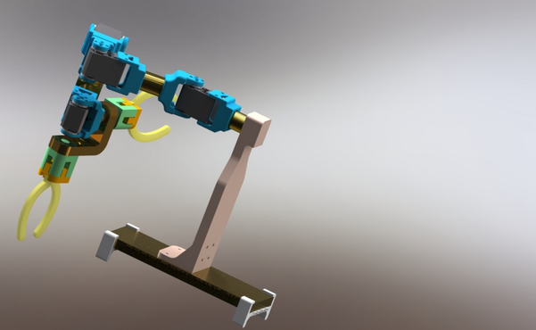
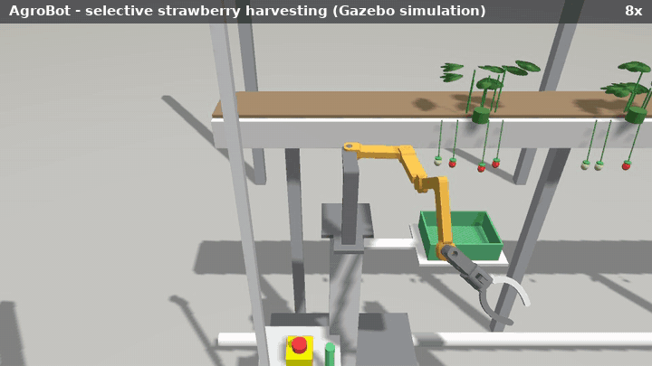
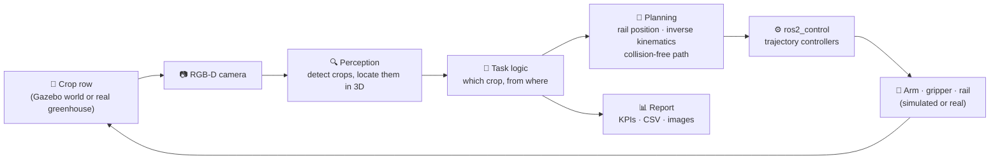

# AIBOMECH AgroBot

**An agricultural robot arm for greenhouses, from kinematic analysis to ROS 2 software, simulation and real-hardware commissioning.**

[](https://github.com/basheeraltawil/agrobot-ros2-agricultural-robot-arm/actions/workflows/ci.yml)


[](LICENSE)

| CAD design | The real prototype | The robot in simulation |
|:---:|:---:|:---:|
|  |  |  |

AgroBot is a 4-axis robot arm on a greenhouse rail trolley, with a single-jaw gripper and an RGB-D camera. It detects crops, decides which ones to handle, plans collision-free motions and executes them. The same software runs in the Gazebo simulator and on the real robot.

The project covers the full development chain of a robot:

1. **Analysis.** Denavit–Hartenberg kinematics, workspace and Lagrangian dynamics of the arm, [published](#citation) and recomputed step by step in Python.
2. **Design.** A physically realistic model built from the CAD of the prototype, with servo sizing and the cell layout.
3. **Software.** ROS 2 control, perception, inverse kinematics, collision checking and motion planning.
4. **Applications.** Four agricultural scenarios with measurable results.
5. **Hardware.** A `ros2_control` driver, motor-board firmware, an emulator, and a step-by-step commissioning guide.

## Results

Four agricultural tasks run end to end in simulation. Each crop's outcome is verified from the simulator's ground truth:

| Scenario | The problem it addresses | Result |
|---|---|---|
| **Strawberry harvesting** | labour shortage for selective picking | 12 of 12 ripe fruit picked into the crate, no unripe fruit |
| **Plant inspection** | manual yield counting and scouting | 12/12 ripe and 10/10 unripe fruit counted, canopy and size per plant |
| **Seedling transplanting** | repetitive, precise nursery handwork | 8 of 8 seedlings planted in their pots |
| **Precision weeding** | herbicide-free weed control | 8 of 8 weeds pulled, lettuce protected by a safety radius |


## How it works



The robot surveys the row, then handles each crop:

1. It moves the trolley so the crop lands where the arm can reach it well.
2. It looks again to refine the crop's position.
3. It approaches along a straight line, grips the crop and places it.

Crops that are blocked by a neighbour are retried after the rest of the row is done. The [architecture guide](docs/architecture.md) explains every layer with diagrams.

## Quick start

Requires Ubuntu 22.04 with ROS 2 Humble.

```bash
# Dependencies (Gazebo Fortress comes with ros-humble-ros-gz)
sudo apt install ros-humble-desktop ros-humble-ros-gz ros-humble-gz-ros2-control \
                 ros-humble-ros2-control ros-humble-ros2-controllers ros-humble-xacro \
                 python3-rosdep python3-colcon-common-extensions

# Get and build the workspace (it is part of this repository)
git clone https://github.com/basheeraltawil/agrobot-ros2-agricultural-robot-arm.git
cd agrobot-ros2-agricultural-robot-arm/agrobot_ws
source /opt/ros/humble/setup.bash
rosdep install --from-paths src --ignore-src -r -y
colcon build --symlink-install
source install/setup.bash

# Run a scenario: Gazebo, controllers, RViz and the task start together
ros2 launch aibomech_agrobot_tasks scenario.launch.py scenario:=strawberry_harvest
```

The four scenarios are `strawberry_harvest`, `plant_inspection`, `seedling_transplant` and `precision_weeding`. Add `gui:=false` to run without the Gazebo window. Every run writes a report (`summary.json`, `results.csv`, annotated images) to `~/.ros/agrobot_reports/`.

## Documentation

| Read this | To learn |
|---|---|
| [Scenarios](docs/scenarios.md) | the four agricultural tasks: the real-world problem, how each works, results, and what is needed for the field |
| [Robot design](docs/robot_design.md) | the arm, gripper, carrier, camera and electronics, and why they are built this way |
| [Analysis](analysis/README.md) | summary of kinematics, workspace, dynamics and actuator sizing, with code and figures |
| [Kinematics](analysis/kinematics.md) · [Dynamics](analysis/dynamics.md) | the full derivations with equations and worked examples |
| [Architecture](docs/architecture.md) | how the software is built: layers, ROS graph, frames, perception and planning pipelines, safety |
| [Real robot](docs/real_robot.md) | step-by-step commissioning: parts, wiring, firmware, calibration, checklists |
| [Development guide](docs/development.md) | building, testing, adding your own task, configuration reference, troubleshooting |
| [Glossary](docs/glossary.md) | the robotics terms used in this project |

## Repository layout

```text
aibomech_agrobot/
├── agrobot_ws/                      ROS 2 workspace: build here with colcon
│   └── src/
│       ├── aibomech_agrobot_description   robot model: xacro, meshes, limits, calibration
│       ├── aibomech_agrobot_bringup       controllers and launch for mock / real hardware
│       ├── aibomech_agrobot_gazebo        simulation worlds and launch
│       ├── aibomech_agrobot_hardware      real-robot driver, firmware, board emulator
│       └── aibomech_agrobot_tasks         perception, IK, planning, the four scenarios
├── analysis/                        kinematics, dynamics, workspace, sizing
│   ├── mathematica/                 original symbolic derivation (thesis)
│   └── python/                      recomputation for the real robot, figures
└── docs/                            design, architecture, scenarios, commissioning
```

Every package has its own short README with its files and launch commands; the [tasks package README](agrobot_ws/src/aibomech_agrobot_tasks/README.md) has a reading order for the code.

## Who can use it

| Audience | What this repository offers |
|---|---|
| **Researchers** | a reproducible perception → planning → control pipeline with ground-truth scoring, to compare detectors, planners or grippers on the same crop layouts |
| **Educators and students** | small, readable implementations of IK, collision checking, RRT planning and Euler–Lagrange dynamics; four complete worked robot applications |
| **Companies** | a template for greenhouse automation cells: rail as an external axis, KPI reports, and a hardware path from emulator to real robot |

**Limitations.** Crop detection uses colour thresholds tuned on the simulated crops; real fields need a trained detector (see the notes per scenario). Grasping in simulation is emulated with joints, as is common in agricultural simulation. The real-hardware driver has been tested against its emulator; commissioning on the physical robot follows the [guide](docs/real_robot.md).

## Author

**Basheer Al-Tawil**. The robot and its analysis originate from a master's thesis on a 4-DoF agricultural manipulator, published in the paper below.

## Citation

If you use this work, please cite the paper:

```bibtex
@article{altawil2023design,
  title={Design and analysis of a four dof robotic arm with two grippers used in agricultural operations},
  author={Altawil, Basheer and Can, Fatih Cemal},
  journal={International Journal of Applied Mathematics Electronics and Computers},
  volume={11},
  number={2},
  pages={79--87},
  year={2023},
  doi={10.18100/ijamec.1217072},
  publisher={PLUSBASE AKADEM{\.I} ORGAN{\.I}ZASYON VE DANI{\c{S}}MANLIK}
}
```

GitHub also offers this citation through the "Cite this repository" button ([CITATION.cff](CITATION.cff)). Licensed under the [BSD 3-Clause License](LICENSE).
