# AIBOMECH AgroBot: ROS 2 agricultural manipulator

AIBOMECH AgroBot is a 4-axis agricultural arm with a single-acting jaw gripper. It rides on a greenhouse rail trolley and uses an RGB-D camera. This repository holds the complete ROS 2 software stack:

- **Robot model.** A physically realistic model built from the CAD of the real prototype.
- **Control.** `ros2_control` with three back-ends: mock, Gazebo and the real robot.
- **Real-robot hardware.** A C++ hardware interface, firmware for the motor-controller board, and a board emulator for testing without the board.
- **Scenarios.** Four agricultural scenarios with perception, inverse kinematics, collision checking and motion planning.
- **Real-robot guide.** Step-by-step instructions for moving from simulation to the real robot.


| Scenario | Task | World | Result in simulation |
|---|---|---|---|
| `strawberry_harvest` | Selective harvesting of ripe strawberries from a table-top gutter | `strawberry_greenhouse` | 10/12 ripe fruit in the crate, 0 unripe |
| `plant_inspection` | Per-plant fruit count, ripeness, fruit size, canopy cover, yield estimate | `strawberry_greenhouse` | 12/12 ripe and 10/10 unripe fruit counted |
| `seedling_transplant` | Soil blocks from a propagation tray into pots | `nursery_transplanting` | 8/8 seedlings potted |
| `precision_weeding` | Detect weeds between lettuce and pull them out with the root | `weeding_bed` | 8/8 weeds detected, 7/8 removed |

**Target platform:** ROS 2 Humble (Ubuntu 22.04) and Gazebo Fortress (`ros_gz` 0.244, `gz_ros2_control` 0.7).

### How it works in one picture

The robot drives along a crop row on a rail, looks at the plants with an RGB-D camera, decides which crops to handle, plans a collision-free motion for its 4-axis arm and executes it with the same controllers in simulation and on the real hardware.

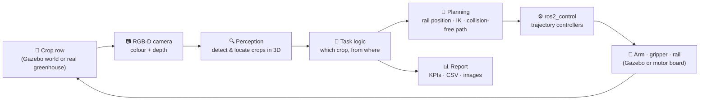

### What you can use it for

| Use | How this repository helps |
|---|---|
| **Agricultural robotics research** | A complete, reproducible pipeline (perception → planning → control) with ground-truth scoring in simulation, so a new detector, planner or gripper can be compared on the same crop layouts |
| **Teaching ROS 2 and robotics** | Small, readable Python for IK, collision checking and RRT planning; standard `ros2_control`, URDF/xacro, Gazebo and launch patterns; four worked examples of complete robot tasks |
| **Prototyping greenhouse automation** | Harvesting, scouting, transplanting and weeding cycles you can tune (layouts, speeds, detection) before building hardware, including cycle-time and success-rate reports |
| **Commissioning the real AgroBot** | The real hardware plugin, firmware, board emulator, calibration files and a step-by-step bring-up guide; the tasks run unchanged on the robot |
| **A template for your own robot** | Replace the URDF and the hardware plugin, keep the task layer; or keep the robot and add a new crop task (see [Adding your own task](#adding-your-own-task)) |

What it is **not**: a certified industrial controller, or a trained crop detector. The colour thresholds work for the simulated crops and need tuning (or a learned model) for real fields; the safety chain on the real robot must include a hardware e-stop.

---

## Contents

1. [Repository layout](#repository-layout)
2. [What changed from the ROS 1 version](#what-changed-from-the-ros-1-version)
3. [The robot model](#the-robot-model)
4. [Install and build](#install-and-build)
5. [Quick start](#quick-start)
6. [Agricultural scenarios](#agricultural-scenarios)
7. [How the system is built](#how-the-system-is-built)
8. [Moving to the real robot: step by step](#moving-to-the-real-robot-step-by-step)
9. [Adding your own task](#adding-your-own-task)
10. [Configuration reference](#configuration-reference)
11. [Glossary](#glossary)
12. [Troubleshooting](#troubleshooting)
13. [Development notes](#development-notes)

---

## Repository layout

The ROS 2 packages live in the colcon workspace `agrobot_ws/src/`. Build from `agrobot_ws/`.

| Package / folder | Contents |
|---|---|
| `aibomech_agrobot_description` | URDF/xacro: arm, gripper, rail trolley, lift column, crate, RGB-D camera, `ros2_control` tags; meshes; CAD mass properties; `tools/compute_physical_params.py` |
| `aibomech_agrobot_bringup` | `robot.launch.py` for mock and real hardware, the controller configuration (`controllers.yaml`) and the RViz layout |
| `aibomech_agrobot_gazebo` | The three Gazebo worlds, their generator (`tools/generate_worlds.py`), the ground-truth object lists, the bridge configurations, `sim.launch.py` and `sim_manager.py` |
| `aibomech_agrobot_hardware` | `ros2_control` SystemInterface for the real robot (serial protocol, watchdog, e-stop), Arduino firmware and the board emulator |
| `aibomech_agrobot_tasks` | Python task layer: kinematics/IK, collision model, RRT-Connect planner, RGB-D crop detection, the four scenario nodes and `scenario.launch.py` |
| `Manuplator-Analysis-and-control` (repository root, not a ROS package) | Mathematica derivation of the arm dynamics (Jacobians, inertia matrix, Christoffel symbols, joint torques, workspace) and a PyTorch image-segmentation notebook |

How the packages depend on each other (arrows point to what a package uses):

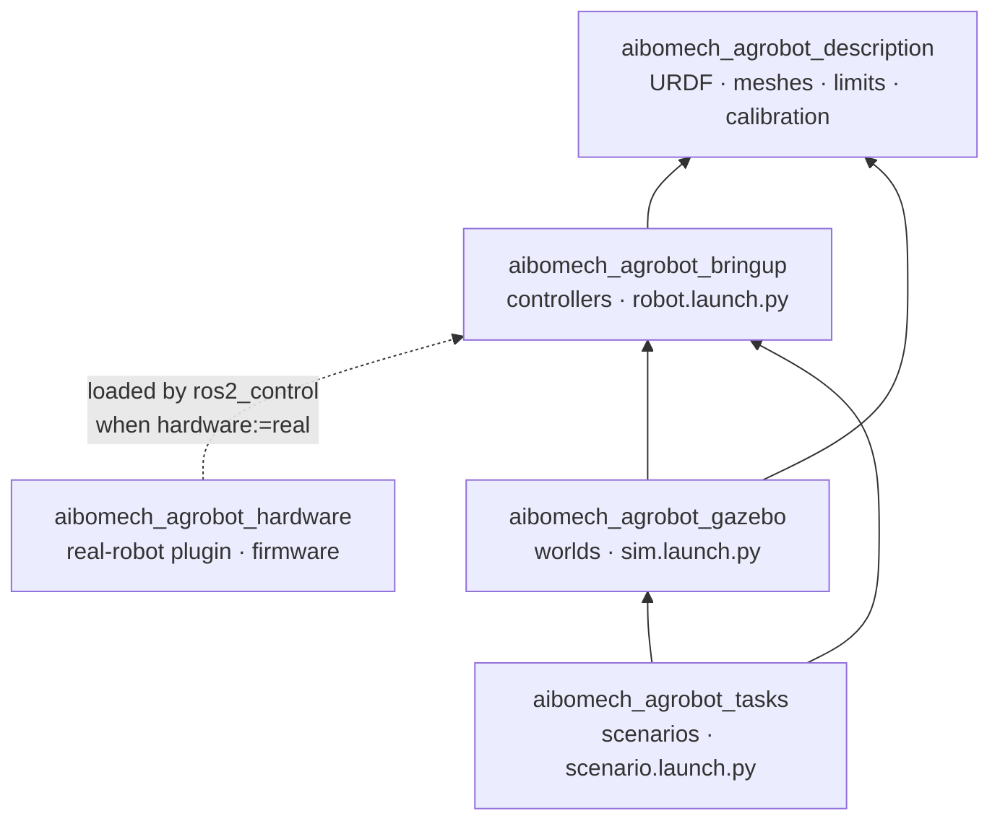

The original ROS 1 (catkin) package is preserved in the git history under the tag [`ros1-legacy`](../../tree/ros1-legacy).

---

## What changed from the ROS 1 version

| ROS 1 package | ROS 2 stack |
|---|---|
| Single URDF from the SolidWorks exporter, plus hand-edited copies | Parametric xacro. One file serves every platform (`rail_trolley`, `pedestal`, `table`) and every hardware back-end (`mock`, `gz`, `real`) |
| Placeholder masses (0.15 kg per link), `velocity="0"` limits, 150 N·m effort | CAD masses and inertias plus the servo in each link (parallel-axis theorem), actuator-rated velocity and effort limits, damping and friction, and soft limits (`safety_controller`) |
| Full meshes used as collision geometry | Collision boxes derived from the meshes. The L-shaped base and the gripper jaws are split into several boxes, so the gripper has a real opening |
| Gazebo Classic with `gazebo_ros_control` and a `joint_states_to_gazebo.py` relay | Gazebo Fortress with `gz_ros2_control`; the same controllers run in simulation and on the robot |
| `rosserial` Arduino sketch sending raw angles | `ros2_control` hardware plugin with a checksummed serial protocol, per-joint calibration, a communication watchdog, e-stop handling and a board emulator |
| Arm fixed to the world | The arm sits on a lift column on a heating-pipe rail trolley (a 7th, external linear axis) with a harvest crate, an electrical cabinet, an e-stop and a signal tower |
| No sensors | RGB-D camera (RealSense D435 class) on a mast, with the same topic names in simulation and on the robot |
| No application | Four agricultural scenarios with perception, IK, collision checking, planning, KPI reports and e-stop handling |

The arm's kinematics and meshes are unchanged, so everything here applies to the real prototype. Joints were renamed to industrial style:

| ROS 1 | ROS 2 |
|---|---|
| `revolute_1` | `joint_1` |
| `revolute_2` | `joint_2` |
| `revolute_3` | `joint_3` |
| `revolute_4` | `joint_4` |
| `prismatic_1` | `gripper_jaw_joint` |

---

## The robot model

### Kinematics and frames

| Joint | Type | Function | Range | Velocity limit | Effort limit |
|---|---|---|---|---|---|
| `joint_1` | revolute | shoulder, vertical axis | -1.09 … 2.10 rad | 2.0 rad/s | 2.9 N·m |
| `joint_2` | revolute | elbow, vertical axis (SCARA plane) | -2.10 … 1.11 rad | 2.0 rad/s | 2.9 N·m |
| `joint_3` | revolute | wrist pitch, horizontal axis | -2.00 … 1.10 rad | 2.0 rad/s | 2.9 N·m |
| `joint_4` | revolute | wrist rotation | -1.00 … 2.30 rad | 3.0 rad/s | 1.5 N·m |
| `gripper_jaw_joint` | prismatic | moving jaw (0.010 = open, 27 mm gap) | -0.017 … 0.010 m | 0.05 m/s | 20 N |
| `rail_joint` | prismatic | trolley along the crop row (external axis) | 0 … 3 m | 0.3 m/s | 200 N |

The standard frames follow ROS-Industrial conventions:

- `base`: the J1 axis on the mounting plate.
- `flange` / `tool0`: the wrist mounting face, z pointing out of the tool.
- `tcp`: the point between the jaws, z along the approach direction.
- `arm_mount`: the mounting plate on the lift column; the task layer plans in this frame.
- `crate`: the drop-off point.
- `camera_color_optical_frame`: same name as the `realsense2_camera` driver.

Every limit lives in `agrobot_ws/src/aibomech_agrobot_description/config/joint_limits.yaml`. The physical parameters are regenerated with `python3 agrobot_ws/src/aibomech_agrobot_description/tools/compute_physical_params.py`, which reads the CAD CSV and the actuator table in that script.

### Why the arm needs the rail

With four axes, three are needed to place the TCP, which leaves one degree of freedom to orient the gripper. The IK in `kinematics.py` uses it to align the approach direction as well as it can. A workspace analysis shows two things:

- **Top-down grasps** are accurate to within about 4° on a ring 0.25–0.32 m from J1, about 6–7 cm below the mounting plate.
- **Horizontal grasps into the crop row** work best with the target about 0.15–0.20 m to the side of J1.

Commercial greenhouse robots solve this with their rail. The task layer does the same: for every target it tries several trolley positions (`rail_offsets`) and keeps the one with the best tool orientation that also has a collision-free path.

### Carrier platforms (`platform:=`)

- **`rail_trolley`** (default): a trolley on 51 mm heating pipes, an aluminium lift column (`mount_height`, default 0.85 m), the crate on a bracket beside the arm, the electrical cabinet, the e-stop and the camera mast.
- **`pedestal`**: the same column on a floor plate, without the rail.
- **`table`**: the arm screwed directly onto a table, like the lab prototype.

---

## Install and build

The repository already contains a ready colcon workspace, `agrobot_ws/`, with every package in `agrobot_ws/src/`. Clone, build, run:

```bash
# 1. ROS 2 Humble and Gazebo Fortress (ros-humble-ros-gz installs Fortress)
sudo apt install ros-humble-desktop ros-humble-ros-gz ros-humble-gz-ros2-control \
                 ros-humble-ros2-control ros-humble-ros2-controllers ros-humble-xacro \
                 ros-humble-joint-state-publisher-gui python3-opencv python3-numpy python3-yaml \
                 python3-rosdep python3-colcon-common-extensions

# 2. Clone and build the workspace
git clone https://github.com/basheeraltawil/aibomech_agrobot.git
cd aibomech_agrobot/agrobot_ws
source /opt/ros/humble/setup.bash
rosdep install --from-paths src --ignore-src -r -y   # run 'sudo rosdep init && rosdep update' once if rosdep is new
colcon build --symlink-install
source install/setup.bash
```

Every new terminal needs `source <repo>/agrobot_ws/install/setup.bash`. Add it to `~/.bashrc` if you use the robot daily.

For the real robot, also install `ros-humble-realsense2-camera`. To flash the firmware you need the Arduino IDE or `arduino-cli`.

To run the tests, run these from `agrobot_ws/` after building:

```bash
colcon test
colcon test-result --verbose
```

The tests cover URDF expansion for every platform and back-end, the serial protocol, and the task layer's IK, collision model and planner. `build/`, `install/` and `log/` are git-ignored.

---

## Quick start

```bash
# 1. Look at the model, move the joints with sliders
ros2 launch aibomech_agrobot_description view_robot.launch.py

# 2. Controllers on mock hardware (no physics), try a trajectory
ros2 launch aibomech_agrobot_bringup robot.launch.py hardware:=mock
ros2 action send_goal /arm_controller/follow_joint_trajectory control_msgs/action/FollowJointTrajectory \
  "{trajectory: {joint_names: [joint_1, joint_2, joint_3, joint_4], points: [{positions: [0.5, -0.5, 0.3, 0.8], time_from_start: {sec: 2}}]}}"

# 3. Gazebo with a scenario world, but no task running
ros2 launch aibomech_agrobot_gazebo sim.launch.py world:=strawberry_greenhouse

# 4. A complete scenario: Gazebo, controllers, RViz and the task node
ros2 launch aibomech_agrobot_tasks scenario.launch.py scenario:=strawberry_harvest
ros2 launch aibomech_agrobot_tasks scenario.launch.py scenario:=seedling_transplant gui:=false
```

Every task run writes a report to `~/.ros/agrobot_reports/<task>_<timestamp>/`:

- `summary.json`: the KPIs.
- `results.csv`: one row per crop.
- Annotated camera images.

In RViz, the *Detection image* panel shows what the camera classified, and the yellow markers show the 3D positions of the detections.

---

## Agricultural scenarios

Every scenario is started with one command. `scenario.launch.py` picks the matching world, starts Gazebo, the controllers and RViz, and then the task node with its YAML configuration:

```bash
ros2 launch aibomech_agrobot_tasks scenario.launch.py scenario:=<name> [gui:=false] [rviz:=false] [hardware:=sim|real|mock]
```

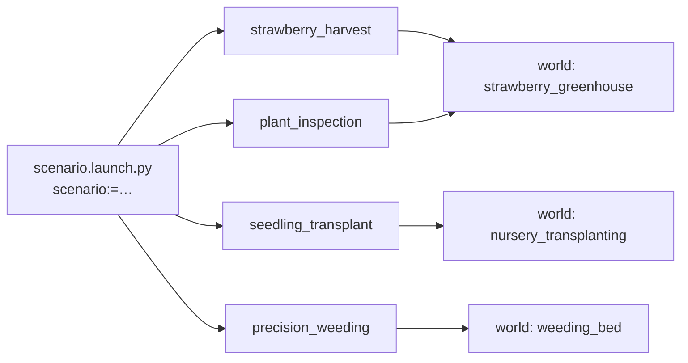

The worlds are generated by `agrobot_ws/src/aibomech_agrobot_gazebo/tools/generate_worlds.py` with fixed random seeds, so every run sees the same crop. Change the seed or the layout there and re-run the script. It rewrites the world, the ground-truth list (`config/<world>_objects.yaml`) and the bridge configuration.

### 1. Selective strawberry harvesting (`strawberry_harvest`)

**Scene.** A table-top gutter 1.0 m high runs along the rail with six strawberry plants. Their trusses hang over the aisle edge with ripe (red) and unripe (pale green) fruit, 19 mm in diameter.

**Pipeline:**

1. **Survey.** The trolley stops at six stations. The camera segments ripe and unripe fruit in HSV. The 3D position comes from the median depth of each blob, pushed back by the fruit radius. Detections from all stations are fused in the world frame.
2. **Plan.** For every ripe fruit, the rail candidates are evaluated with IK, first for a horizontal approach and then for approaches tilted 20° up, down or sideways. The choice must pass three checks: the approach line and the retreat line are collision-free, and the planner finds a path from home. Non-target fruit and the gutter are obstacles (see [Motion planning pipeline](#motion-planning-pipeline)).
3. **Look again.** At the chosen rail position the fruit is re-detected, so rail and calibration errors are corrected.
4. **Pick.**
   - Straight-line approach.
   - Close the jaw on the fruit width.
   - Pull back and down, which breaks the peduncle.
   - Planned move to the crate, release, then home.
5. **Second pass.** Fruit that could not be reached (usually because a ripe neighbour hangs 3–4 cm away and blocks the gripper) is retried once at the end, when its neighbours are in the crate.
6. **Report.** Detected, attempted and picked fruit, cycle times and, in simulation, fruit verified in the crate. Unripe fruit in the crate counts as an error.

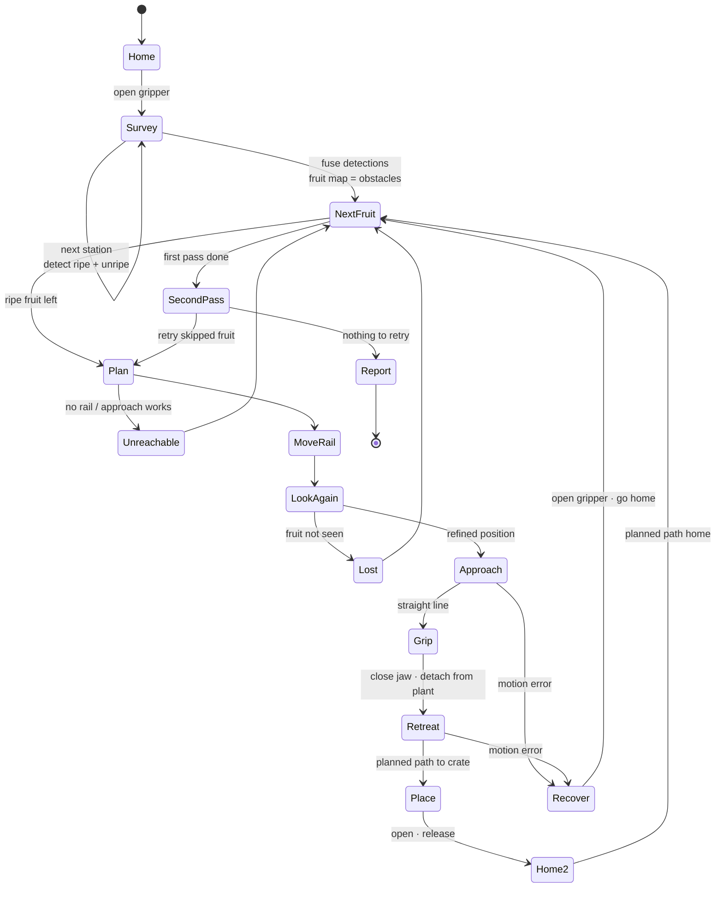

The parameters are in `agrobot_ws/src/aibomech_agrobot_tasks/config/strawberry_harvest.yaml`: survey stations, HSV ranges, approach direction, rail offsets, obstacles and speeds.


### 2. Plant inspection and phenotyping (`plant_inspection`)

This is non-contact: the arm stays folded and the trolley stops in front of each plant. For every plant the report records:

- ripe and unripe fruit count;
- ripeness ratio;
- equivalent fruit diameter;
- canopy cover (leaf-pixel share).

The summary adds the harvest-ready mass (`mean_fruit_mass_kg`). This is the daily scouting job a real greenhouse robot runs before harvesting.

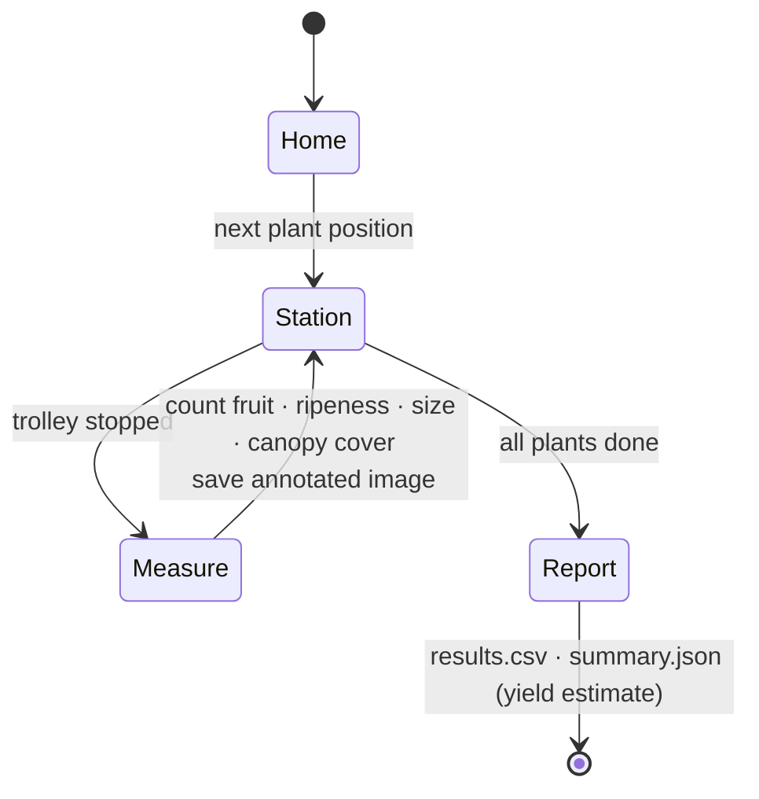


### 3. Seedling transplanting (`seedling_transplant`)

**Scene.** A potting bench 0.75 m high with a 2 × 4 propagation tray of 50 mm soil blocks (60 mm pitch, low walls) and a 2 × 4 grid of pots.

**Pipeline.** The tray and the pots are fixtures with taught positions (first cell plus pitch), as in nursery automation. For each cell:

1. Camera check that the cell holds a seedling.
2. Top-down pick of the block.
3. Lift, and move the rail to the pot.
4. Top-down place, release, lift.

The soil blocks stand higher than the tray walls, so the open jaws (about 60 mm across) never enter a cell. That is also why commercial transplanters prefer soil blocks.

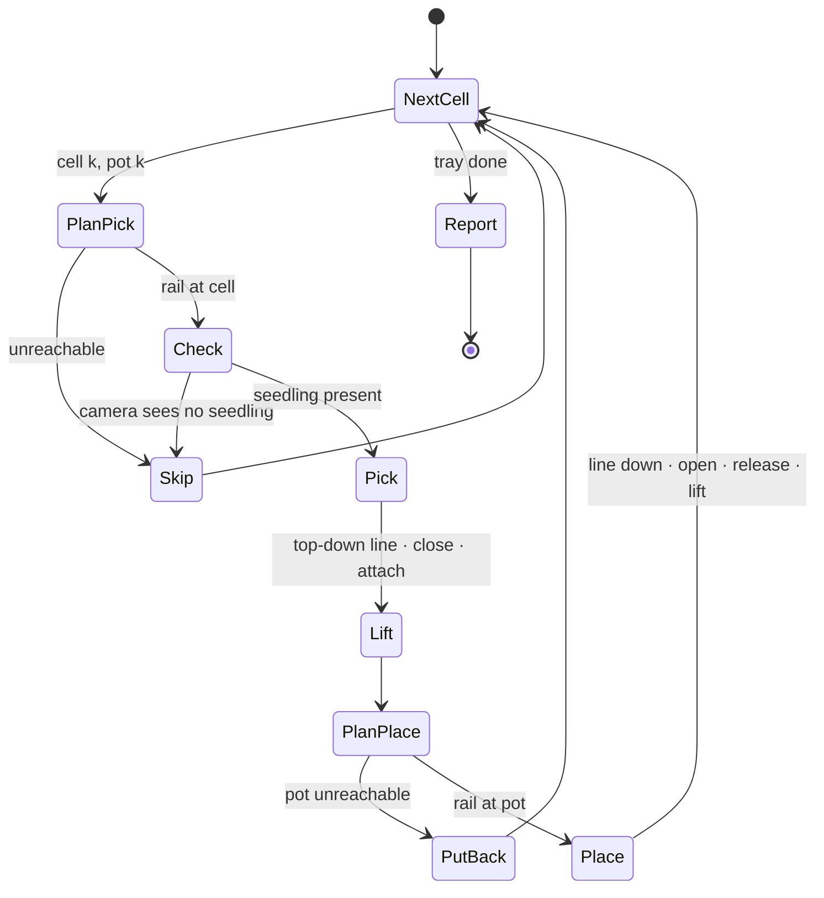

### 4. Precision weeding (`precision_weeding`)

**Scene.** A raised lettuce bed with purple broadleaf weeds in the inter-row.

**Pipeline:**

1. Survey detects weeds (purple) and lettuce (large green blobs).
2. Weeds closer than `crop_protection_radius` (6 cm) to a lettuce are left alone and reported. A real system would switch to a finer tool, a laser or a micro-sprayer there.
3. Every other weed is gripped at the stem, pulled 8 cm straight up with its root, and dropped into the bin on the trolley.
4. Lettuce heads are obstacles for the planner.

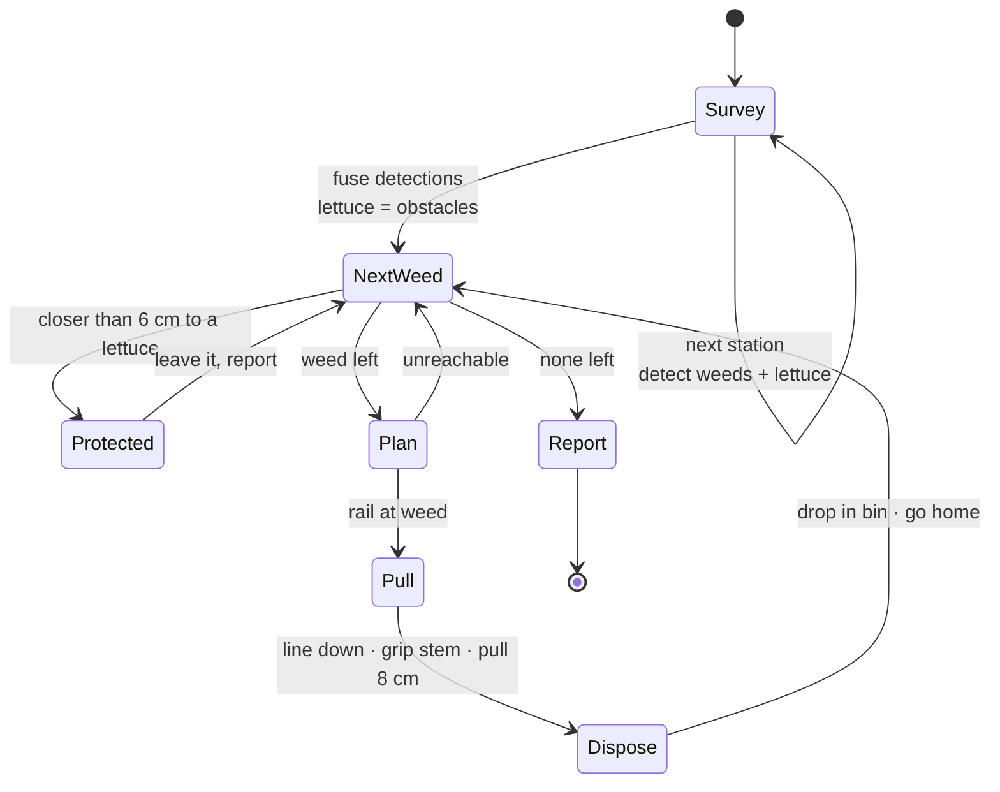


### Simulation results

Headless runs on a laptop (real-time factor below 1 because the camera is rendered):

| Scenario | Result | Mean cycle time |
|---|---|---|
| strawberry_harvest | 12/12 ripe fruit detected, 10 picked and verified in the crate, 2 reported unreachable, 0 unripe picked | 80 s |
| plant_inspection | 6 plants, 12/12 ripe and 10/10 unripe fruit counted | – |
| seedling_transplant | 8/8 seedlings placed in pots (verified from simulation poses) | 37 s |
| precision_weeding | 8/8 weeds detected, 7 removed, 1 aborted safely on contact | 47 s |

Cycle times include IK, planning and the 0.6 s camera settle time. They are dominated by Python planning and would drop to around 10–15 s with a compiled planner. Failures are reported per crop in `results.csv`, never by crashing the run.

### How grasping is simulated

Gazebo cannot hold a 19 mm strawberry reliably through friction, so contact grasping is emulated, as is common in agricultural simulation:

- **Grasp joints.** Each crop has a `DetachableJoint` towards the gripper link (`/agrobot/sim/<obj>/attach_gripper`, `…/detach_gripper`).
- **Plant or soil anchors.** Fruit and weeds are held by a second joint (`…/detach_anchor`), which the robot "cuts" or "pulls".
- **Start-up.** Gazebo creates these joints already attached, so `sim_manager.py` detaches them all while the world is still paused, and only then starts physics.
- **Collision cores.** Crops have small collision cores so the open jaws do not push them away.
- **Task layer.** The task nodes call `attach`, `release` and `detach_from_plant`. They are no-ops on the real robot (`sim_grasp:=false`), where the gripper physically holds the crop and the pull-back breaks the stem.

---

## How the system is built

This section explains how the parts fit together, from the physical robot up to the task logic. Read it before changing anything; every scenario and the real robot reuse the same layers.

### Layered architecture

The system has four layers. Each layer only talks to the layer directly below it through standard ROS 2 interfaces. That is why a task that works in Gazebo runs unchanged on the real robot.

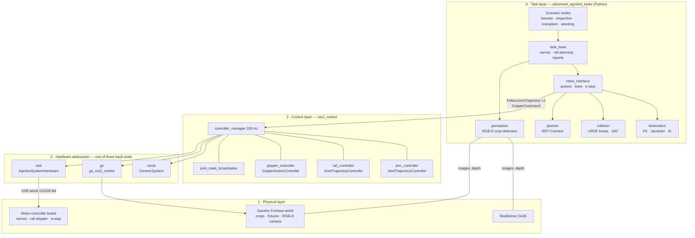

| Layer | What it is responsible for | What you change here |
|---|---|---|
| 4. Tasks | What to do: find crops, choose where to put the rail, plan collision-free motions, grasp, report | New agricultural tasks, detection thresholds, crop layouts |
| 3. Control | Following joint trajectories smoothly and within tolerances, opening and closing the gripper | Gains, tolerances, update rate (`controllers.yaml`) |
| 2. Hardware abstraction | Turning joint commands into actuator commands and reading joint states | New actuators or drives (a new `SystemInterface` plugin) |
| 1. Physical | The robot, the crops and the camera, real or simulated | Mechanics, wiring, world models |

### ROS 2 graph: nodes, topics and actions

The graph below is what runs during `scenario.launch.py`. In simulation, the camera topics come from `ros_gz_bridge`. On the real robot, the same topic names come from `realsense2_camera`.

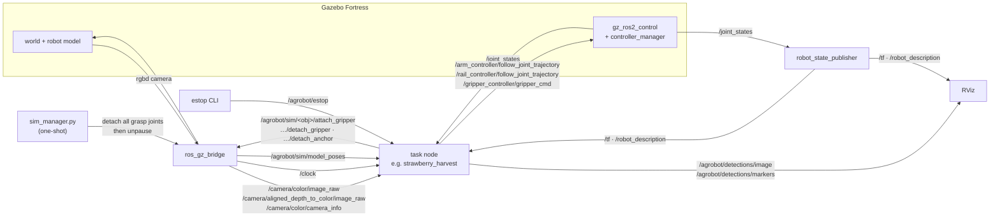

| Interface | Type | Direction | Purpose |
|---|---|---|---|
| `/arm_controller/follow_joint_trajectory` | `control_msgs/FollowJointTrajectory` (action) | task → controller | Arm motion (joints 1–4) |
| `/rail_controller/follow_joint_trajectory` | `control_msgs/FollowJointTrajectory` (action) | task → controller | Trolley position along the row |
| `/gripper_controller/gripper_cmd` | `control_msgs/GripperCommand` (action) | task → controller | Open or close the jaw |
| `/joint_states` | `sensor_msgs/JointState` | controller → all | Measured joint positions and velocities |
| `/camera/color/image_raw`, `/camera/aligned_depth_to_color/image_raw`, `/camera/color/camera_info` | `sensor_msgs/Image`, `CameraInfo` | camera → task | RGB-D input for crop detection |
| `/agrobot/detections/image`, `/agrobot/detections/markers` | `Image`, `MarkerArray` | task → RViz | What the robot detected, for debugging |
| `/agrobot/estop` | `std_msgs/Bool` (latched) | operator → task | Software emergency stop |
| `/agrobot/sim/model_poses` | `tf2_msgs/TFMessage` | Gazebo → task | Ground truth, only used to score a simulated run |
| `/agrobot/sim/<obj>/attach_gripper`, `…/detach_gripper`, `…/detach_anchor` | `std_msgs/Empty` | task → Gazebo | Simulated grasping (no-ops on the real robot) |

### Frames (TF tree)

All positions in the task layer are expressed in `world` (crop map) or `arm_mount` (motion planning). The rail joint moves everything below `trolley`, so a crop's position in `arm_mount` changes when the trolley moves.

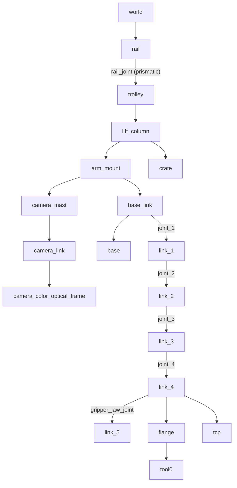

### Simulation start-up

Grasping in Gazebo relies on `DetachableJoint`s, which Gazebo creates *attached*. The launch sequence therefore loads the world paused, releases all grasp joints, and only then starts physics and the controllers.

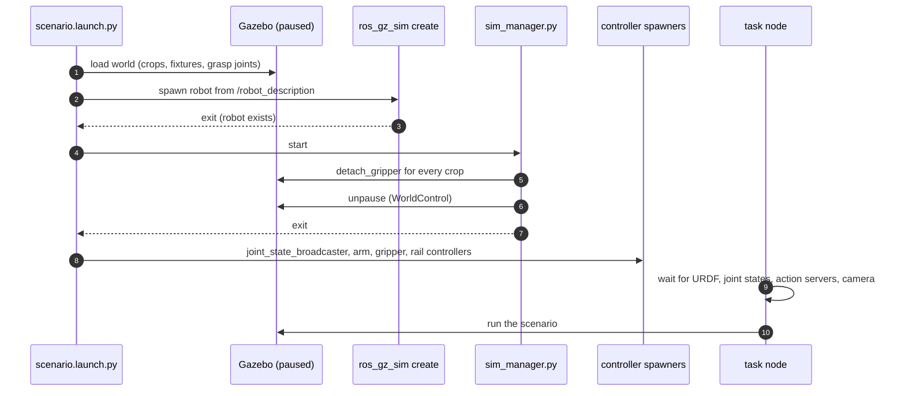

### Inside the task layer

| Module | Responsibility | Key ideas |
|---|---|---|
| `perception.py` | Find crops in the RGB-D image and turn them into 3D points | HSV thresholds per class, blob size window, median depth, shift by object radius, transform with TF into `world`, crop region filter |
| `kinematics.py` | Forward and inverse kinematics from the URDF | Geometric Jacobian; IK solves position first, then uses the one redundant DOF to align the approach direction (null-space); multi-start; `track`/`refine` for local solutions |
| `collision.py` | Is a joint configuration collision-free? | The URDF's own collision boxes, separating-axis test, arm vs. carrier, arm vs. itself, arm and held crop vs. obstacle boxes (gutter, bench, crops) |
| `planner.py` | Collision-free joint path between two configurations | RRT-Connect with random shortcutting; direct path if already free |
| `robot_interface.py` | Execute motions safely | Planned joint moves (quintic segments), straight TCP lines that stay on one arm branch, rail and gripper actions, e-stop cancelling, simulated grasp topics |
| `task_base.py` | Shared scenario logic | Rail as external axis (`plan_reach`), crop obstacles, recovery, sim ground truth, reports |

#### Perception pipeline

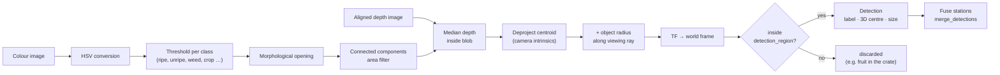

#### Motion planning pipeline

For every crop the task layer answers: *where must the trolley stand, and how does the arm get there without hitting anything?*

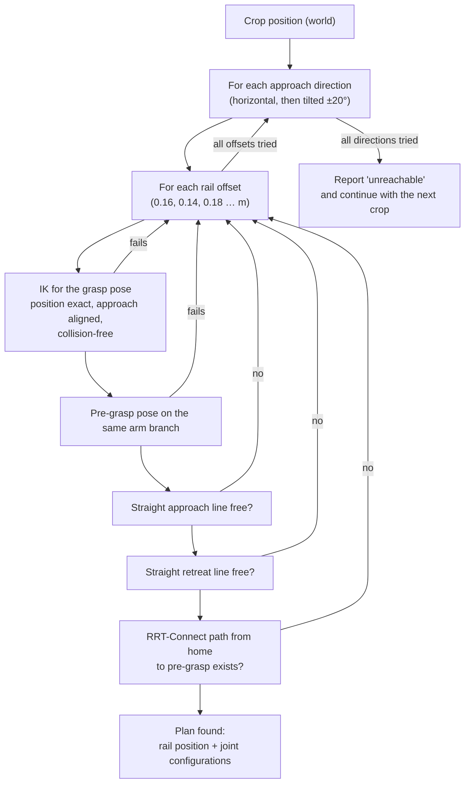

### One harvest cycle, end to end

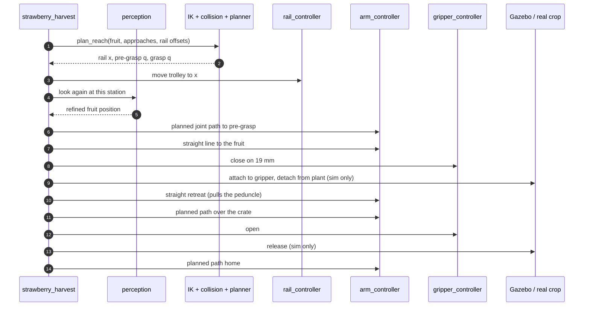

### Real-robot data path

On the real robot the same controllers talk to `AgrobotSystemHardware`, which exchanges short ASCII frames with the motor-controller board.

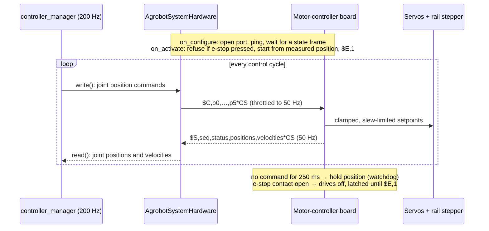

### Safety layers

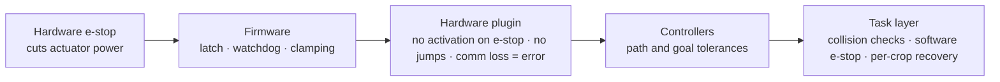

1. **Motor-controller board.** A hardware e-stop input (normally-closed contact) cuts servo PWM and disables the stepper. It stays latched until the host re-enables it. A 250 ms command watchdog holds position if commands stop, and setpoints are clamped and slew-limited in firmware.
2. **Hardware plugin.** It refuses to activate while the e-stop is pressed, starts from the measured position (no jump), and reports a communication error after 10 missed frames.
3. **Controllers.** Path and goal tolerances abort a trajectory if the arm is blocked.
4. **Task layer.**
   - A software e-stop on `/agrobot/estop` (`ros2 run aibomech_agrobot_tasks estop on|off`) cancels motion.
   - Every joint move is collision-checked and planned, and linear moves are checked point by point.
   - A failed crop is reported and the robot recovers to home.

---

## Moving to the real robot: step by step

The task nodes, controllers and topic names are identical in simulation and on the robot. Only the hardware back-end and the camera driver change. Work through the steps in order; each one is tested before the next adds risk.

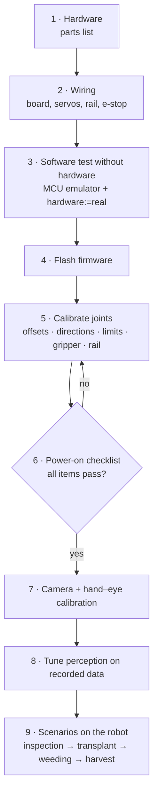

| | Simulation | Real robot |
|---|---|---|
| Launch | `scenario.launch.py` (default `hardware:=sim`) | `scenario.launch.py hardware:=real serial_port:=… platform:=…` |
| ros2_control plugin | `gz_ros2_control/GazeboSimSystem` | `aibomech_agrobot_hardware/AgrobotSystemHardware` |
| Camera topics | from `ros_gz_bridge` | from `realsense2_camera` (same names) |
| Grasping | `DetachableJoint` topics (`sim_grasp:=true`) | the jaw holds the crop, the retreat breaks the stem (`sim_grasp:=false`) |
| Clock | `/clock` from Gazebo (`use_sim_time`) | system time |
| Scoring | ground truth from Gazebo poses | from `results.csv` and the operator |

### Step 1: Hardware (bill of materials)

| Item | Recommendation | Notes |
|---|---|---|
| J1–J3 actuators | 12 V smart serial servos, ≥ 2.9 N·m (Feetech STS3215, Dynamixel XL430-W250) | Must match the effort limits in `joint_limits.yaml`. Smart servos report their real position |
| J4 and gripper | STS3032 / XL330 class servo; gripper servo on a rack driving the moving jaw | Gripper stroke 27 mm |
| Motor-controller board | Arduino Mega 2560, ESP32 or Teensy 4.1 | Runs `firmware/agrobot_mcu` |
| Rail axis | NEMA17 or NEMA23 stepper, TMC2209 driver, GT2 belt or rack; home switch at the rail start | Only for `platform:=rail_trolley` |
| Camera | Intel RealSense D435 / D435i | Mounted as in `camera.xacro` (`camera_xyz`, `camera_rpy` arguments) |
| Safety | Mushroom e-stop (NC contact) wired in series with the actuator supply and to the e-stop pin; 24 V/12 V supply with fuses | The e-stop must cut power in hardware. The software e-stop is only a supplement |
| Computer | Ubuntu 22.04 with ROS 2 Humble (NUC, Jetson Orin or laptop) | USB 3 for the camera |

### Step 2: Wire the controller board

| Signal | Pin (Arduino Mega) |
|---|---|
| Servo PWM J1, J2, J3, J4, gripper | 3, 5, 6, 9, 10 |
| Rail STEP / DIR / ENABLE | 22 / 23 / 24 |
| Rail home switch (to GND) | 25 |
| E-stop contact (NC, to GND) | 2 |

Power the servos from a separate supply with a common ground; never power them from the board. If you use smart bus servos, replace the PWM output and the position estimate in the firmware with the servo library's read and write calls. The protocol to ROS stays the same.

### Step 3: Test the whole software chain without hardware

```bash
ros2 run aibomech_agrobot_hardware mcu_emulator.py --link /tmp/agrobot_mcu
ros2 launch aibomech_agrobot_bringup robot.launch.py hardware:=real serial_port:=/tmp/agrobot_mcu
ros2 control list_controllers          # all four active
pkill -USR1 -f mcu_emulator.py         # press the emulated e-stop, watch the log
```

This exercises the real plugin, the serial protocol, the watchdog and the e-stop path.

### Step 4: Flash the firmware

1. Open `agrobot_ws/src/aibomech_agrobot_hardware/firmware/agrobot_mcu/agrobot_mcu.ino`.
2. Check the pin assignment and the `SERVO_CENTER_US`, `SERVO_US_PER_UNIT` and `RAIL_STEPS_PER_M` values for your hardware.
3. Flash the board, for example `arduino-cli compile -b arduino:avr:mega … && arduino-cli upload …`.
4. Give the serial device a fixed name with a udev rule, for example `/dev/agrobot_mcu`, and add yourself to the `dialout` group.

### Step 5: Calibrate the joints

1. **Mechanical zero.** Move every joint by hand, or at low torque, to the pose the URDF calls zero. `ros2 launch aibomech_agrobot_description view_robot.launch.py` with all sliders at 0 shows that pose.
2. **Read the offsets.** With the robot launched on real hardware, run `ros2 topic echo /joint_states` and read the reported positions. Enter them with opposite sign as `offset` in `agrobot_ws/src/aibomech_agrobot_description/config/hardware_calibration.yaml`, or pass your own file with `calibration_file:=`.
3. **Directions.** Command small moves, for example +0.1 rad with the `ros2 action send_goal` line from the Quick start. Compare them with RViz and set `direction: -1` where the real joint turns the other way.
4. **Limits.** Jog each joint towards both ends at `speed_scale` 0.2. Keep the software limits at least 3° inside the mechanical stops.
5. **Gripper.** Close the jaw on a 20 mm gauge. The jaw position should read about 0.0026. Tune `jaw_gap_offset` in the task configuration if it differs.
6. **Rail.** Home the rail, drive to 1.000 m and measure. Correct `RAIL_STEPS_PER_M`.

### Step 6: First power-on checklist

- [ ] E-stop cuts actuator power, and the log shows "EMERGENCY STOP pressed".
- [ ] `robot.launch.py hardware:=real` refuses to activate while the e-stop is pressed.
- [ ] RViz model matches the real arm in at least three poses.
- [ ] Home pose (`HOME` in `task_base.py`) is collision-free on the real robot.
- [ ] Unplugging USB stops the arm within 0.25 s (watchdog).
- [ ] The first scenario run uses `speed_scale:=0.2` with the cell cleared of people.

### Step 7: Camera and hand–eye calibration

1. Start the camera: `robot.launch.py … realsense:=true`. It is started with `align_depth.enable:=true`, `publish_tf:=false` and the topic names the tasks expect (`/camera/color/image_raw`, `/camera/aligned_depth_to_color/image_raw`, `/camera/color/camera_info`).
2. Measure the camera pose on the mast and pass it as `camera_xyz:="x y z" camera_rpy:="r p y"` to `robot.launch.py`. For accurate picking, run an eye-to-hand calibration (for example `easy_handeye2` with an ArUco marker in the gripper) and write the result into those two arguments.
3. **Check.** Put a red ball at a measured position, run `plant_inspection`, and compare the logged 3D position. Aim for an error under 5 mm.

### Step 8: Tune perception for real crops

The HSV ranges in the task YAML files were tuned on the rendered colours. Tune them for real crops:

1. Record a bag at the site: `ros2 bag record /camera/color/image_raw /camera/aligned_depth_to_color/image_raw /camera/color/camera_info`.
2. Adjust the ranges until the `/agrobot/detections/image` overlay is clean. Use `detection_region` to exclude the crate and the background.

For production, replace `segment()` in `perception.py` with a trained segmentation network. The PyTorch notebook in `Manuplator-Analysis-and-control` is a starting point. The rest of the pipeline, from depth to world coordinates and planning, stays unchanged.

### Step 9: Run the scenarios on the real robot

```bash
ros2 launch aibomech_agrobot_tasks scenario.launch.py scenario:=plant_inspection hardware:=real serial_port:=/dev/agrobot_mcu
ros2 launch aibomech_agrobot_tasks scenario.launch.py scenario:=strawberry_harvest hardware:=real platform:=rail_trolley
```

Suggested order: `plant_inspection` (no contact) → `seedling_transplant` (fixtures, easy objects) → `precision_weeding` → `strawberry_harvest`.

Adapt the following to your site:

- **Obstacle boxes (`obstacles`).** Enter the real gutter, bench or bed dimensions.
- **Fixture positions.** Teach the tray and pot positions: jog the TCP to the first cell, read the `tcp` frame from TF, and enter it in the YAML.
- **`mount_height`.** Pass the real height of the lift column (the `mount_height` argument).

`sim_grasp` is switched off automatically with `hardware:=real`.

### Recovering from an e-stop

1. Release the e-stop.
2. Re-activate the hardware:

   ```bash
   ros2 control set_hardware_component_state AgrobotSystem inactive
   ros2 control set_hardware_component_state AgrobotSystem active
   ros2 run aibomech_agrobot_tasks estop off
   ```

The task that was running exits with code 2; restart it. It re-surveys the crop, so no state is lost.

---

## Adding your own task

A new agricultural task (for example tomato de-leafing, sprout thinning or fruit counting on a different crop) is a new node on top of `AgrobotTask`. You get the robot interface, the camera, planning, collision checking and reporting for free.

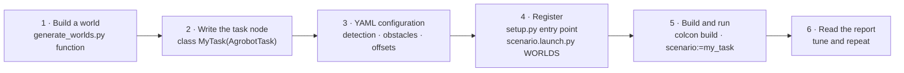

1. **World.** Add a function to `aibomech_agrobot_gazebo/tools/generate_worlds.py` that places your crops. Use `grasp_plugin()` for objects the robot picks and `anchor_plugin()` for objects fixed to a plant or the soil. Keep crop fixtures `<static>` and inside the arm's reach (about 0.25–0.32 m from J1 for top-down grasps, 6–7 cm below the mount plate). Run the script; it writes the world, the object list and the bridge file.
2. **Task node.** Create `aibomech_agrobot_tasks/scenarios/my_task.py`:

   ```python
   import numpy as np
   from ..perception import classes_from_params
   from ..task_base import AgrobotTask, run_task

   DOWN = np.array([0.0, 0.0, -1.0])

   class MyTask(AgrobotTask):
       name = 'my_task'

       def __init__(self):
           super().__init__()
           self.classes = classes_from_params(self.node, 'detection', ['target'])

       def execute(self):
           self.go_home()
           self.robot.move_rail(0.5)
           detections, image = self.camera.detect(self.classes)
           for det in detections:
               plan = self.plan_reach(det.position, DOWN, 0.05, [0.0, 0.05, -0.05], np.radians(35))
               if plan is None:
                   continue
               self.robot.move_rail(plan.rail)
               self.robot.move_joints(plan.q_pre)
               p = self.robot.world_to_base(det.position)
               self.robot.move_linear(p, DOWN, None, plan.q_grasp)
               # ... grip, lift, place ...
               self.go_home()
           self.write_report({'view.png': image})

   def main():
       raise SystemExit(run_task(MyTask))
   ```

3. **Configuration.** Create `config/my_task.yaml` with the `detection.<class>.hsv_ranges`, `detection_region` and `obstacles` of your scene (see [Configuration reference](#configuration-reference)).
4. **Register.** Add `'my_task = aibomech_agrobot_tasks.scenarios.my_task:main'` to `setup.py` and `'my_task': '<world name>'` to `WORLDS` in `launch/scenario.launch.py`.
5. **Run.** `colcon build --symlink-install`, then `ros2 launch aibomech_agrobot_tasks scenario.launch.py scenario:=my_task`.

---

## Configuration reference

Parameters shared by all task nodes (set them in the task's YAML file or with `-p name:=value`):

| Parameter | Default | Meaning |
|---|---|---|
| `speed_scale` | 0.5 (0.7 in the task files) | Fraction of the joint velocity limits used for joint moves |
| `cartesian_speed` | 0.04 m/s | TCP speed on straight approach and retreat lines |
| `home_joints` | `[-0.97, -2.0, -1.12, 1.46]` | Folded pose outside the camera view; start, recovery and return pose |
| `rail_limits` | `[0.03, 2.97]` m | Rail range the tasks may use (kept off the end stops) |
| `obstacles` | none | Fixed scene boxes, flat list `[cx, cy, cz, sx, sy, sz, …]` in the world frame |
| `detection_region` | unlimited | Box `[x_min, x_max, y_min, y_max, z_min, z_max]` (world) outside which detections are ignored |
| `detection.<class>.hsv_ranges` | – | One or more ranges `h_lo s_lo v_lo h_hi s_hi v_hi` (OpenCV units, H 0–179) |
| `detection.<class>.min_area` / `max_area` | 30 / 20000 px | Blob size window |
| `detection.<class>.radius` | 0.01 m | Surface-to-centre correction along the viewing ray |
| `gripper_open`, `gripper_effort`, `jaw_gap_offset` | 0.010 m, 8 N, 0.0174 m | Gripper opening, force, and the jaw offset used to close on an object of known width |
| `sim_grasp` | `true` in simulation | Drive the Gazebo grasp joints; set automatically by `scenario.launch.py` |
| `report_dir` | `~/.ros/agrobot_reports` | Where reports are written |

Task-specific parameters (all in `agrobot_ws/src/aibomech_agrobot_tasks/config/`):

| Task | Main parameters |
|---|---|
| `strawberry_harvest` | `survey_stations`, `approaches` (tried in order), `rail_offsets`, `pregrasp_distance`, `retreat_offset`, `max_approach_error_deg`, `fruit_width`, `fruit_obstacle_size`, `drop_height`, `refine_radius`, `max_fruit` |
| `plant_inspection` | `plant_positions`, `plant_window`, `mean_fruit_mass_kg`, `detection.leaf` |
| `seedling_transplant` | `tray.first_cell`, `tray.pitch`, `tray.cols/rows`, `tray.grasp_z`, `pots.*`, `check_occupancy`, `plug_width`, `lift_height`, `max_plants` |
| `precision_weeding` | `survey_stations`, `crop_protection_radius`, `crop_obstacle_size`, `grasp_height_above_detection`, `stem_width`, `pull_height`, `max_weeds` |

Robot-level configuration (in `agrobot_ws/src/aibomech_agrobot_description/config/` and `aibomech_agrobot_bringup/config/`):

| File | Contents |
|---|---|
| `joint_limits.yaml` | Position, velocity and effort limits, damping, friction, soft-limit margins |
| `arm_physical.yaml` | Generated masses, inertias and collision boxes (do not edit by hand) |
| `initial_positions.yaml` | Start pose for simulation and mock hardware |
| `hardware_calibration.yaml` | Real robot: board channel, direction and offset per joint |
| `controllers.yaml` | Controller types, joints, update rate and trajectory tolerances |

---

## Glossary

| Term | Meaning here |
|---|---|
| **TCP** (tool centre point) | The point between the gripper jaws where a crop's centre should be when it is gripped; frame `tcp`, z axis = approach direction |
| **Approach direction** | The direction the gripper moves in to reach a crop: horizontal into the row for strawberries, straight down for seedlings and weeds |
| **Pre-grasp / grasp / retreat** | The pose a few centimetres before the crop, the pose at the crop, and the pose the gripper pulls back to |
| **IK** (inverse kinematics) | Computing joint angles for a desired TCP position and approach direction |
| **Rail as external axis** | The trolley position is chosen per crop, like the 7th axis of an industrial cell, to put the crop where the arm can reach it well |
| **RRT-Connect** | A sampling-based planner that grows two trees of collision-free joint configurations until they meet |
| **ros2_control** | The ROS 2 framework that connects controllers (trajectory, gripper) to hardware plugins (mock, Gazebo, real) |
| **JTC** | `JointTrajectoryController`, follows time-stamped joint waypoints within tolerances |
| **xacro** | XML macros that generate the URDF robot description with parameters |
| **DetachableJoint** | A Gazebo plugin that creates and removes a fixed joint between two models; used to simulate gripping and cutting |
| **HSV** | Hue-saturation-value colour space; hue separates red fruit, green leaves and purple weeds well |
| **Survey** | Driving along the row and detecting all crops before acting on them |
| **KPI report** | `summary.json` and `results.csv` written after every run: detections, successes, cycle times |

---

## Troubleshooting

| Symptom | Cause and fix |
|---|---|
| `cv_bridge` crashes with `_ARRAY_API not found` | NumPy 2 from pip shadows the system NumPy. The tasks avoid `cv_bridge`, but other tools need `pip install "numpy<2"` |
| Rail does not move in Gazebo | A prismatic joint that *starts* exactly on its limit is locked by the physics engine. `initial_positions.yaml` starts the rail at 0.05 m |
| Robot joints frozen in a new world | A joint to `world` in more than one model freezes the robot's rail in Gazebo Fortress. Crop fixtures are `<static>` models |
| Two simulations interfere | gz-transport ignores `ROS_DOMAIN_ID`. Set a different `IGN_PARTITION` per simulation |
| A fruit is reported `unreachable` | No rail position and approach direction gives a collision-free grasp; usually a neighbour or the gutter is in the way. It is retried after the first pass. Try more `rail_offsets` or `approaches`, or a smaller `fruit_obstacle_size` |
| Your own simulation stops when another one starts | Two launches on one machine share ROS topics and Gazebo transport. Use a different `ROS_DOMAIN_ID` and `IGN_PARTITION` per session |
| `path tolerance violation` during a task | The arm touched something the collision model does not know about. Add the object to `obstacles`, or raise `crop_protection_radius` or `fruit_obstacle_size` |
| Everything is black in Gazebo | A GPU or EGL problem. Try `export LIBGL_ALWAYS_SOFTWARE=1`, or run with `gui:=false` |

---

## Development notes

- **Collision model.** The task layer's collision model reads the same boxes as Gazebo, so a motion that passes the checker does not jam in simulation.
- **Grasp tuning.** Tune `jaw_gap_offset` and the TCP (`tcp_*` in `arm.xacro`) together if you change the gripper.
- **Worlds.** Regenerate them after changing `MOUNT_HEIGHT` or the robot geometry: `python3 agrobot_ws/src/aibomech_agrobot_gazebo/tools/generate_worlds.py`.
- **Physical parameters.** Regenerate them after changing the CAD or the actuators: `python3 agrobot_ws/src/aibomech_agrobot_description/tools/compute_physical_params.py`.
- **Possible extensions:**
  - a MoveIt 2 configuration for interactive planning;
  - a trained crop detector;
  - a soft or vacuum end effector for larger fruit;
  - a mobile base instead of the rail.

## License

BSD-3-Clause, see [LICENSE](LICENSE).
