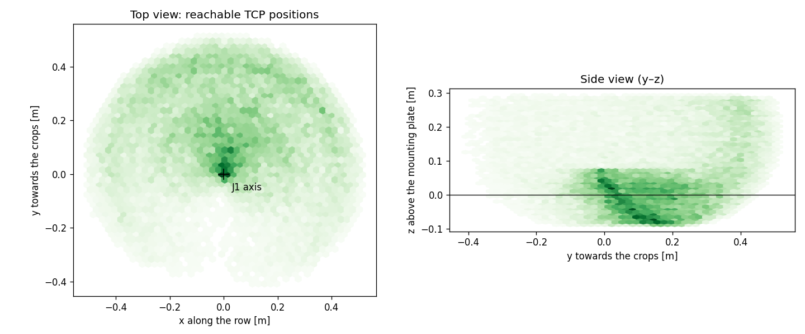
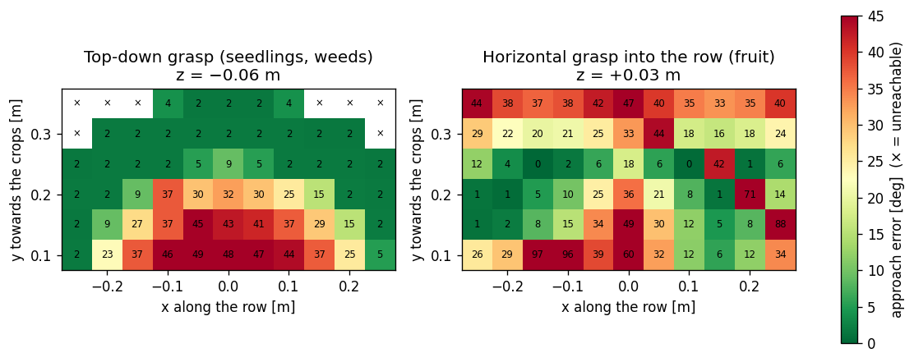
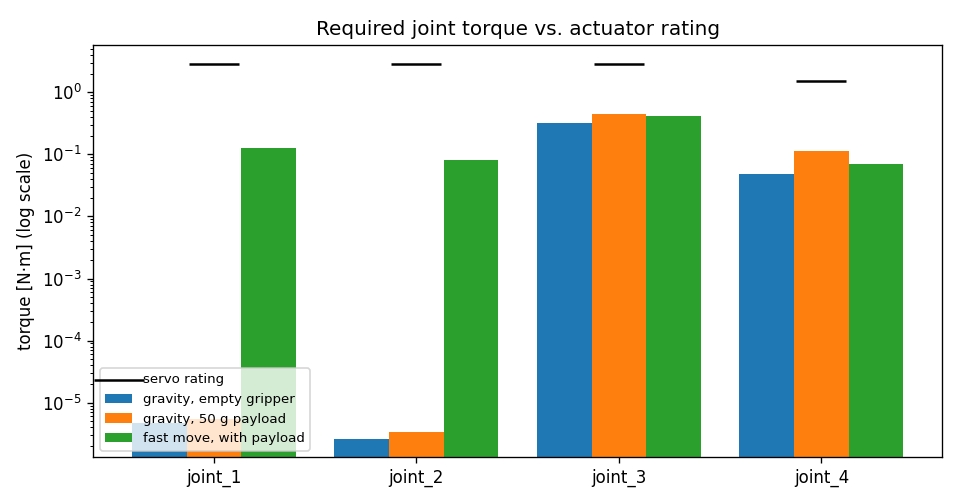

# Analysis: kinematics, workspace, dynamics and design calculations

This folder explains how the AgroBot arm moves, what it can reach and how strong its motors must be. The analysis was published in:

> B. Altawil and F. C. Can, "Design and Analysis of a Four DoF Robotic Arm with Two Grippers Used in Agricultural Operations," *International Journal of Applied Mathematics Electronics and Computers*, 11(2), 79–87, 2023. [doi:10.18100/ijamec.1217072](https://doi.org/10.18100/ijamec.1217072)

| Read | For |
|---|---|
| [kinematics.md](kinematics.md) | Denavit–Hartenberg model, transformation matrices, forward kinematics of both end effectors, Jacobian, inverse kinematics, each with a worked example |
| [dynamics.md](dynamics.md) | Lagrangian dynamics: inertia matrix, Christoffel symbols, Coriolis and gravity terms, a fully evaluated example, servo sizing |
| this page | summary of all results, workspace and design calculations |
| [`mathematica/`](mathematica/) | the original symbolic derivation (22 notebooks, with plain-text copies) |
| [`python/`](python/) | short, commented scripts that recompute every result and produce the figures |
| [`paper/`](paper/altawil2023_four_dof_agricultural_arm.md) | text of the paper |

Run the scripts:

```bash
pip install -r requirements.txt                  # numpy, sympy, matplotlib, pyyaml; no ROS needed
cd analysis/python
python3 01_kinematics_thesis_model.py            # D-H and symbolic kinematics (~30 s)
python3 02_workspace.py                          # workspace and approach maps (~2 min)
python3 03_thesis_dynamics_check.py              # check of the thesis torques
python3 04_torque_sizing.py                      # joint torques vs. servo ratings
python3 05_design_calculations.py                # mass budget, gripper, camera, rail
```

| Script | Question it answers | Mathematica notebooks |
|---|---|---|
| `robot_model.py` | Shared model: forward kinematics, Jacobians, M(q), C(q, q̇), G(q) from the URDF | 01–14 (same method) |
| `01_kinematics_thesis_model.py` | D-H transforms, where both end effectors are, Jacobian, closed-form IK (worked example) | 01–07, 19 |
| `02_workspace.py` | Where can the gripper go, and from which direction? | 18 |
| `03_thesis_dynamics_check.py` | Are the thesis torques right? M, C, G and τ of the worked example | 12–16 |
| `04_torque_sizing.py` | Are the servos strong enough? | 15–17 |
| `05_design_calculations.py` | Mass, gripper opening, camera resolution, rail cycle | – |

`data/agrobot.urdf` is the robot description expanded from `agrobot_ws/src/aibomech_agrobot_description/urdf/agrobot.urdf.xacro`, so the scripts use exactly the geometry and masses of the simulated and real robot.

---

## 1. Kinematics

The arm has two vertical joints (J1, J2: a SCARA pair), a pitch joint (J3) and a wrist (J4). A trolley on the greenhouse heating pipes adds a fifth, linear axis along the crop row.

The paper describes it with the Denavit–Hartenberg convention. Each link contributes one matrix

$$
A_i = \operatorname{Rot}_z(\theta_i)\,\operatorname{Trans}_z(d_i)\,\operatorname{Trans}_x(a_i)\,\operatorname{Rot}_x(\alpha_i), \qquad {}^{0}T_{n} = A_1 A_2 \cdots A_n
$$

and the gripper position follows from the product. For example:

$$
P_{e2z} = -a_3 \sin\theta_3 - d_4 \cos\theta_3 - a_{4e2} \sin(\theta_3 - \theta_4)
$$

The height does not depend on $\theta_1, \theta_2$, so the inverse kinematics has a closed form: $\theta_3$ from the height, then $\theta_1, \theta_2$ from the two-link formula. [kinematics.md](kinematics.md) derives all matrices and works through an example forward and back. `01_kinematics_thesis_model.py` checks that the D-H product reproduces the paper's equations.

The ROS 2 software computes the same forward kinematics directly from the URDF. It solves the inverse kinematics numerically, because its v2 wrist is perpendicular to J3 (see [kinematics.md §9](kinematics.md#9-from-the-paper-model-to-the-ros-2-robot)).

## 2. Workspace

`02_workspace.py` samples 40 000 random joint configurations inside the joint limits and plots every reached gripper position (a Monte Carlo workspace, the numeric version of notebook 18):



- Reach from the J1 axis: up to **0.51 m**.
- Gripper height: **−0.09 m to +0.29 m** relative to the mounting plate.

Reaching a point is not enough; the gripper must also come from the right direction. The approach maps solve the IK on a grid and colour each cell by how far the gripper is from the wanted approach direction:



- **Top-down grasps** (seedlings, weeds) are accurate (within about 10°, mostly 2°) on a band 0.25–0.32 m from J1, 6–7 cm below the mounting plate. This set the bench and tray heights of the transplanting and weeding scenarios.
- **Horizontal grasps into the row** (hanging fruit) work best when the fruit is to the side of J1 along the row, not straight ahead of it (25–50° error there).

That is why the trolley rail matters: for every crop the software moves the trolley so that the crop lands in one of these good regions, exactly like the external axis of an industrial robot cell.

## 3. Dynamics

The equation of motion follows from the Euler–Lagrange method, as in the paper:

$$
\tau = M(\theta)\,\ddot{\theta} + C(\theta,\dot{\theta})\,\dot{\theta} + G(\theta)
$$

| Term | Formula | Meaning |
|---|---|---|
| Inertia matrix | $M(\theta) = \sum_i m_i J_{v_i}^\top J_{v_i} + J_{\omega_i}^\top R_i I_i R_i^\top J_{\omega_i}$ | resistance to acceleration; changes with the pose |
| Christoffel symbols | $c_{ijk} = \tfrac{1}{2}\left(\frac{\partial M_{kj}}{\partial \theta_i} + \frac{\partial M_{ki}}{\partial \theta_j} - \frac{\partial M_{ij}}{\partial \theta_k}\right)$ | how $M$ changes as the arm moves |
| Coriolis/centrifugal | $C_{kj} = \sum_i c_{ijk}\,\dot{\theta}_i$ | torques from moving joints influencing each other |
| Gravity | $G_k = \partial P / \partial \theta_k$ with $P = \sum_i m_i g z_{ci}$ | torque needed to hold the arm still |

[dynamics.md](dynamics.md) derives every term and evaluates it at the pose of notebook 16. The result: gravity on joint 3 is about 160 times the velocity terms there, and the vertical joints J1 and J2 carry no weight at all.

`robot_model.py` implements the same formulas numerically from the URDF and checks itself:

- $G(\theta)$ equals the gradient of the potential energy.
- $M(\theta)$ is symmetric and positive definite.
- $\dot{M} - 2C$ is skew-symmetric (energy conservation).

### Check of the thesis torques

`03_thesis_dynamics_check.py` takes $M(\theta)$ exactly as written in notebook 12b and recomputes the example of notebook 16 ($\theta$ = 30°, 20°, 90°, −15°; $\dot{\theta}$ = 0.5, 0.4, 0.4, 0.4 rad/s):

| Joint | Notebook 16 | Recomputed without ½ | With the standard ½ |
|---|---|---|---|
| τ1 | −22.931 | −22.931 | −11.466 |
| τ2 | −3.131 | −3.131 | −1.566 |
| τ3 | 10.586 | 10.586 | 5.293 |
| τ4 | 3.124 | 3.458 | 1.729 |

(kg·cm²/s², 1 kg·cm²/s² = 10⁻⁴ N·m)

The notebook's values are reproduced exactly when the factor ½ is left out of the Christoffel symbols, so the thesis Coriolis/centrifugal torques are twice too large. The review found three more points: the gravity term is missing, $R_{40}$ in notebook 01 has a sign error, and the Jacobians of links 3 and 4 differ from the exact derivatives. See [dynamics.md §8](dynamics.md#8-review-of-the-thesis-computation).

## 4. Actuator sizing

`04_torque_sizing.py` evaluates the full equation of motion of the real arm: CAD masses including the servos, a 50 g payload in the gripper, a fast move at the velocity limits.

| joint | gravity, empty | gravity, 50 g payload | fast move | servo rating | safety factor |
|---|---|---|---|---|---|
| J1 | 0.000 | 0.000 | 0.128 | 2.9 N·m | 23× |
| J2 | 0.000 | 0.000 | 0.082 | 2.9 N·m | 35× |
| J3 | 0.322 | 0.455 | 0.410 | 2.9 N·m | 6× |
| J4 | 0.048 | 0.115 | 0.070 | 1.5 N·m | 13× |



- J1 and J2 turn about vertical axes, so gravity does not load them; they only accelerate the arm.
- J3 carries the forearm and gripper against gravity. It is the critical joint and still has a safety factor of 6 with a 30 kg·cm (2.9 N·m) smart servo.
- The paper's prototype used 15 kg·cm LX-16A servos and reported vibrations at J1 and J3. With that servo J3 has only a 3.2× margin, which is why v2 doubles it ([dynamics.md §9](dynamics.md#9-from-torques-to-motors)).
- The dynamic torques at these speeds are small compared with gravity. A lighter servo would do for J1 and J2, but a common part for J1–J3 simplifies spares.

## 5. Design calculations

`05_design_calculations.py` prints the numbers behind the cell design.

| item | calculation | result |
|---|---|---|
| Arm mass | CAD parts ×1.10 (fasteners, cables) + one 60 g servo per joint, combined with the parallel-axis theorem $I = I_c + m(\lVert d\rVert^2 I - d d^\top)$ | 0.49 kg moving, 0.31 kg base |
| Gripper opening | gap = jaw position + 17.4 mm | 27 mm open, grips objects up to about 23 mm |
| Camera coverage | width $= 2\,d \tan(\text{HFOV}/2)$ at d = 0.66 m, 69° HFOV | 0.91 m of row, 1.4 mm per pixel, a strawberry ≈ 13 px across |
| Survey stations | 0.40 m apart | 56 % image overlap between stations |
| Rail cycle | quintic profile, $T = 1.875\,\Delta x / v_{\max}$ | 5 s between stations, 3 m row surveyed in ≈ 0.6 min |
| Motion profile | $s(\tau) = 10\tau^3 - 15\tau^4 + 6\tau^5$ | zero velocity and acceleration at start and end, peak velocity 1.875 × average |

---

## Other material

[`learning/image_segmentation_tutorial.ipynb`](learning/) is a guided PyTorch exercise on image segmentation (segmentation-models-pytorch, human-segmentation dataset, from an online guided project), kept as a starting point for a learned crop detector. It is incomplete and not part of the robot software.
