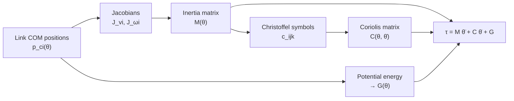

# Dynamics of the AgroBot arm

Kinematics describes motion; dynamics describes the **torques** that produce it. This page derives the equation of motion of the arm with Lagrangian mechanics and Christoffel symbols of the first kind, as in the paper and the Mathematica notebooks. It then evaluates every term in a worked example and uses the result to size the servos.

Reproduce the numbers with [`python/03_thesis_dynamics_check.py`](python/03_thesis_dynamics_check.py) (paper model) and [`python/04_torque_sizing.py`](python/04_torque_sizing.py) (real robot). The kinematics used here is derived in [kinematics.md](kinematics.md).

**Contents:** [1. Overview](#1-overview) · [2. Lagrange's equation](#2-lagranges-equation) · [3. Kinetic energy and the inertia matrix](#3-kinetic-energy-and-the-inertia-matrix) · [4. Christoffel symbols and the Coriolis matrix](#4-christoffel-symbols-and-the-coriolis-matrix) · [5. Potential energy and gravity](#5-potential-energy-and-gravity) · [6. The equation of motion](#6-the-equation-of-motion) · [7. Worked example](#7-worked-example) · [8. Review of the thesis computation](#8-review-of-the-thesis-computation) · [9. From torques to motors](#9-from-torques-to-motors)

## 1. Overview



## 2. Lagrange's equation

The Lagrangian is the kinetic minus the potential energy of all links, $L = K - P$. For every joint $k$ the joint torque follows from

```math
\frac{d}{dt}\frac{\partial L}{\partial \dot{\theta}_k} - \frac{\partial L}{\partial \theta_k} = \tau_k, \qquad k = 1, \dots, 4
```

The advantage of this method is that it only needs energies, which are scalars; the internal forces between the links never appear.

## 3. Kinetic energy and the inertia matrix

**Link model.** The thesis model treats every link as a uniform rod of mass $m_i$ and length $a_i$, with its centre of mass (COM) in the middle:

| | Link 1 | Link 2 | Link 3 | Link 4 |
|---|---|---|---|---|
| Length | $a_1$ = 12 cm | $a_2$ = 12 cm | $a_3$ = 8 cm, $d_4$ = 8 cm | $a_4$ = 8.5 cm |
| Mass | 0.08 kg | 0.08 kg | 0.08 kg | 0.06 kg |

About its COM, a rod has the inertia (notebook 08)

```math
I_i = \frac{1}{12} m_i a_i^2 \begin{bmatrix} 0 & 0 & 0 \\ 0 & 1 & 0 \\ 0 & 0 & 1 \end{bmatrix}
```

in its own frame; in the base frame it becomes $R_i I_i R_i^\top$.

**COM positions** (notebook 04), with the same abbreviations as the forward kinematics:

```math
\begin{aligned}
p_{c1} &= \tfrac{a_1}{2} \begin{bmatrix} C_1 \\ S_1 \\ 0 \end{bmatrix}, \qquad
p_{c2} = \begin{bmatrix} a_1 C_1 + \tfrac{a_2}{2} C_{12} \\ a_1 S_1 + \tfrac{a_2}{2} S_{12} \\ 0 \end{bmatrix} \\[4pt]
p_{c3} &= \begin{bmatrix} a_1 C_1 + a_2 C_{12} + \tfrac{1}{2}(a_3 C_3 - d_4 S_3)\, C_{12} \\ a_1 S_1 + a_2 S_{12} + \tfrac{1}{2}(a_3 C_3 - d_4 S_3)\, S_{12} \\ -\tfrac{1}{2}(a_3 S_3 + d_4 C_3) \end{bmatrix} \\[4pt]
p_{c4} &= \begin{bmatrix} a_1 C_1 + a_2 C_{12} + (a_3 C_3 - d_4 S_3)\, C_{12} + \tfrac{a_4}{2} C_{12} C_{34} \\ a_1 S_1 + a_2 S_{12} + (a_3 C_3 - d_4 S_3)\, S_{12} + \tfrac{a_4}{2} S_{12} C_{34} \\ -a_3 S_3 - d_4 C_3 - \tfrac{a_4}{2} S_{34} \end{bmatrix}
\end{aligned}
```

**Kinetic energy.** Each link translates with its COM velocity $v_{ci} = J_{v_i}\dot{\theta}$ and rotates with $\omega_i = J_{\omega_i}\dot{\theta}$:

```math
K = \sum_{i=1}^{4} \tfrac{1}{2} m_i v_{ci}^\top v_{ci} + \tfrac{1}{2}\omega_i^\top R_i I_i R_i^\top \omega_i
= \tfrac{1}{2}\,\dot{\theta}^\top M(\theta)\,\dot{\theta}
```

Collecting the terms gives the **inertia matrix** (equation 10 of the paper):

```math
M(\theta) = \sum_{i=1}^{4} \left[ m_i J_{v_i}^\top J_{v_i} + J_{\omega_i}^\top R_i I_i R_i^\top J_{\omega_i} \right]
```

$M$ is a 4×4 matrix (equation 11). Its diagonal entry $M_{kk}$ is the inertia that joint $k$ "feels" in the current pose. The off-diagonal entries couple the joints: accelerating one joint loads the others. $M$ is always symmetric and positive definite.

## 4. Christoffel symbols and the Coriolis matrix

Because $M$ changes with the pose, a moving arm experiences velocity-dependent torques: centrifugal torques ($\dot{\theta}_i^2$ terms) and Coriolis torques ($\dot{\theta}_i \dot{\theta}_j$, $i \ne j$). They follow from the derivatives of $M$ through the **Christoffel symbols of the first kind** (equation 12):

```math
c_{ijk} = \frac{1}{2}\left( \frac{\partial M_{kj}}{\partial \theta_i} + \frac{\partial M_{ki}}{\partial \theta_j} - \frac{\partial M_{ij}}{\partial \theta_k} \right)
```

With three indices running over four joints, there are $4^3 = 64$ symbols. They are organised into the 4×4 **Coriolis matrix** (Table 2 and equation 13 of the paper):

```math
C_{kj}(\theta, \dot{\theta}) = \sum_{i=1}^{4} c_{ijk}\,\dot{\theta}_i
```

Every entry of $C$ is a sum of four Christoffel symbols, each weighted by a joint velocity. For example, $C_{11} = c_{111}\dot{\theta}_1 + c_{211}\dot{\theta}_2 + c_{311}\dot{\theta}_3 + c_{411}\dot{\theta}_4$.

A useful check: with this definition, $\dot{M} - 2C$ is skew-symmetric. This expresses energy conservation, and [`robot_model.py`](python/robot_model.py) verifies it numerically.

## 5. Potential energy and gravity

With $z$ pointing up and $g = 9.81$ m/s², the potential energy is the weight of each link times the height of its COM:

```math
P = \sum_{i=1}^{4} m_i\, g\, z_{ci}, \qquad G_k = \frac{\partial P}{\partial \theta_k}
```

Links 1 and 2 stay in the horizontal plane ($z_{c1} = z_{c2} = 0$). Using the heights from section 3:

```math
\begin{aligned}
G_1 &= G_2 = 0 \\
G_3 &= m_3 g \left( -\tfrac{a_3}{2} C_3 + \tfrac{d_4}{2} S_3 \right) + m_4 g \left( -a_3 C_3 + d_4 S_3 - \tfrac{a_4}{2} C_{34} \right) \\
G_4 &= m_4 g\, \tfrac{a_4}{2} C_{34}
\end{aligned}
```

This is why a SCARA pair is attractive: joints 1 and 2 never hold weight. Joint 3 holds the forearm and the gripper and is the most loaded joint at rest.

## 6. The equation of motion

Inserting $K$ and $P$ into Lagrange's equation gives the **equation of motion** (equation 9 of the paper):

```math
\tau = M(\theta)\,\ddot{\theta} + C(\theta, \dot{\theta})\,\dot{\theta} + G(\theta) + J^\top F_e + f_r
```

| Term | Name | Physical meaning |
|---|---|---|
| $M\ddot{\theta}$ | inertia | torque to accelerate the links |
| $C\dot{\theta}$ | Coriolis and centrifugal | torque caused by moving joints influencing each other |
| $G$ | gravity | torque to hold the arm against its weight |
| $J^\top F_e$ | external force | a force $F_e$ at the gripper (pulling a fruit), mapped to the joints |
| $f_r$ | friction | losses in the gears and bearings |

Written per joint, as in equation 14 of the paper:

```math
\tau_k = \sum_{j=1}^{4} M_{kj}\,\ddot{\theta}_j + \sum_{i=1}^{4}\sum_{j=1}^{4} c_{ijk}\,\dot{\theta}_i \dot{\theta}_j + G_k, \qquad k = 1, \dots, 4
```

## 7. Worked example

The pose of notebook 16 (and of the [kinematics example](kinematics.md#6-worked-example)):

```math
\theta = (30^\circ, 20^\circ, 90^\circ, -15^\circ), \qquad \dot{\theta} = (0.5, 0.4, 0.4, 0.4)\ \text{rad/s}, \qquad \ddot{\theta} = 0
```

The model is in cm and kg, so inertias are in kg·cm² and torques in kg·cm²/s² (1 kg·cm²/s² = 10⁻⁴ N·m).

**Inertia matrix** (from notebook 12b, evaluated at the pose):

```math
M = \begin{bmatrix}
64.068 & 2.330 & -12.097 & -4.334 \\
2.330 & 72.236 & 10.638 & 0.024 \\
-12.097 & 10.638 & 22.250 & 6.244 \\
-4.334 & 0.024 & 6.244 & 2.184
\end{bmatrix} \text{kg·cm}^2
```

**Coriolis matrix** (with the factor ½):

```math
C = \begin{bmatrix}
-14.085 & -9.470 & -3.123 & 1.535 \\
2.034 & -5.709 & -0.889 & 0.142 \\
13.915 & -0.588 & -0.591 & -2.982 \\
1.658 & -0.142 & 2.391 & 0
\end{bmatrix} \text{kg·cm}^2\text{/s}
```

**Gravity by hand** ($g$ = 981 cm/s², $C_3 = 0$, $S_3 = 1$, $C_{34} = \cos 105^\circ = -0.259$):

```math
\begin{aligned}
G_3 &= 0.08 \cdot 981 \cdot \tfrac{8}{2} + 0.06 \cdot 981 \cdot \left( 8 + \tfrac{8.5}{2} \cdot 0.259 \right) = 313.9 + 535.6 = 849.5 \\
G_4 &= 0.06 \cdot 981 \cdot \tfrac{8.5}{2} \cdot (-0.259) = -64.7
\end{aligned}
```

**Joint torques:**

| Joint | $C\dot{\theta}$ | $G$ | $\tau$ (kg·cm²/s²) | $\tau$ (N·m) |
|---|---|---|---|---|
| 1 | −11.47 | 0 | −11.47 | −0.0011 |
| 2 | −1.57 | 0 | −1.57 | −0.0002 |
| 3 | 5.29 | 849.54 | 854.84 | 0.0855 |
| 4 | 1.73 | −64.74 | −63.02 | −0.0063 |

Two lessons:

- At these moderate speeds, **gravity dominates**: about 160 times the velocity terms at joint 3.
- Joints 1 and 2 need torque only to accelerate the arm; with $\ddot{\theta} = 0$ and gravity absent, their torques are tiny.

## 8. Review of the thesis computation

Recomputing the notebooks revealed four points. They do not change the design conclusions, but they matter for anyone reusing the derivation:

| # | Finding | Effect |
|---|---|---|
| 1 | The Christoffel symbols of notebooks 12–16 omit the factor ½ | the stored torques $\tau_1$–$\tau_3$ are reproduced exactly without it, so the Coriolis/centrifugal torques are twice too large |
| 2 | The notebooks solve $\tau = M\ddot{\theta} + C\dot{\theta}$, without $G$ | the largest load (gravity on joint 3) is missing |
| 3 | Notebook 01 writes $R_{40}$ with $+C_{12}$ in row 2, column 3; the D-H product gives $-C_{12}$ | the notebook matrix is not a rotation ($R^\top R \neq I$); link 4's inertia and axis inherit the error |
| 4 | The cross-product Jacobians of links 3 and 4 (notebook 07) differ from $\partial p_c / \partial \theta$ | $M(\theta)$ inherits the difference |

The torques of notebook 16 compared with a recomputation from the notebook's own $M$:

| Joint | Notebook 16 | Recomputed without ½ | With ½ |
|---|---|---|---|
| τ1 | −22.931 | −22.931 | −11.466 |
| τ2 | −3.131 | −3.131 | −1.566 |
| τ3 | 10.586 | 10.586 | 5.293 |
| τ4 | 3.124 | 3.458 | 1.729 |

[`robot_model.py`](python/robot_model.py) applies the same method to the real robot with all corrections: exact joint axes from the CAD, CAD masses including the servos, the factor ½ and gravity.

## 9. From torques to motors

The paper's prototype used LX-16A bus servos (15 kg·cm = 1.47 N·m) on every joint, and it reports **vibrations at joints 1 and 3**. The analysis explains why:

- Joint 3 carries the gravity load of the forearm and gripper.
- Joint 1 accelerates the whole arm about the vertical axis.

[`04_torque_sizing.py`](python/04_torque_sizing.py) evaluates the full equation of motion for the real v2 arm. It includes CAD masses with servos, a 50 g payload and a fast quintic move at the velocity limits. The safety factor is the servo rating divided by the largest required torque:

| Joint | Gravity, 50 g payload | Fast move | Required | LX-16A (1.47 N·m) | Selected servo | Safety factor |
|---|---|---|---|---|---|---|
| J1 | 0 | 0.128 | 0.128 | 11.5× | 2.9 N·m | 23× |
| J2 | 0 | 0.082 | 0.082 | 18.0× | 2.9 N·m | 35× |
| J3 | 0.455 | 0.410 | 0.455 | **3.2×** | 2.9 N·m | 6× |
| J4 | 0.115 | 0.070 | 0.115 | 12.8× | 1.5 N·m | 13× |

(torques in N·m)

- J3 has the smallest margin with the LX-16A (3.2×). This leaves little reserve for the flexible 3D-printed links and the servo's own position controller, which matches the vibrations reported at this joint.
- The v2 design uses 2.9 N·m (30 kg·cm) servos on J1–J3, doubling the margin on J3.
- A common servo on J1–J3 also simplifies spare parts.


