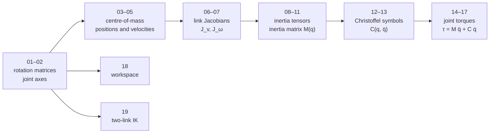

# Mathematica derivation of the arm (master's thesis material)

These notebooks derive the kinematics and the Euler–Lagrange dynamics of the 4-axis arm symbolically. They were written in Mathematica 11.3 and are numbered in the order of the derivation.

GitHub cannot display `.nb` files, so each notebook also has a plain-text copy in [`text/`](text/) with its input cells in Mathematica syntax and its stored numeric results. The copies are regenerated with `python3 analysis/tools/nb_to_text.py`.

## The model

The thesis model treats every link as a uniform rod (centre of mass in the middle) with these parameters:

| symbol | value | meaning |
|---|---|---|
| a1, a2 | 12 cm | the two horizontal (SCARA-plane) links |
| a3, d3 | 8 cm, 8 cm | forearm length and offset of the pitch joint |
| a4 | 8.5 cm | wrist and gripper |
| m1…m4 | 0.05–0.08 kg | link masses (printed parts, without servos) |

Joints 1 and 2 rotate about the vertical axis, joint 3 pitches the forearm, and joint 4 turns the wrist.

## Notebooks

| # | notebook | what it computes |
|---|---|---|
| 01 | `01_rotation_matrices` | orientation R_i0 of each link frame in the base frame |
| 02 | `02_joint_axis_directions` | joint axes z_i = R_i0 · [0 0 1]ᵀ |
| 03 | `03_link_centre_of_mass_vectors` | centre of mass of each link in its own frame (half the link length) |
| 04 | `04_centre_of_mass_positions` | centre-of-mass positions p_ci(q) in the base frame |
| 05 | `05_centre_of_mass_velocities` | time derivatives ṗ_ci, the basis of the linear Jacobians |
| 06 | `06_jacobian_columns_cross_product` | Jacobian columns as z × r cross products |
| 07 | `07_link_jacobians` | linear Jacobians J_v1…J_v4 and angular Jacobians J_ω1…J_ω4 |
| 08 | `08_link_inertia_tensors` | rod inertia (1/12) m a² rotated into the base frame: R I Rᵀ |
| 09 | `09_inertia_matrix_link_terms` | contribution of each link: m J_vᵀ J_v + J_ωᵀ R I Rᵀ J_ω |
| 10 | `10_inertia_matrix_sum` | the 4×4 inertia matrix M(q) and its entries M11…M44 |
| 11 | `11_inertia_matrix_substitution` | substitution and simplification of M(q) |
| 12, 12b, 12c | `12_christoffel_symbols` … | Christoffel symbols from the derivatives of M(q) (12b is the tidy version, 12c in traditional form) |
| 13, 13b | `13_partial_derivative_check` … | checks of single partial derivatives and simplifications |
| 14 | `14_torque_equation_assembly` | assembles the M and C matrices into the torque equation |
| 15 | `15_joint_torques_symbolic` | explicit expressions for τ1…τ4 |
| 16 | `16_joint_torques_numeric_example` | τ1…τ4 at q = (30°, 20°, 90°, −15°), q̇ = (0.5, 0.4, 0.4, 0.4) rad/s |
| 17 | `17_joint_torques_along_trajectory` | τ1…τ4 along a time-parametrised joint trajectory, plotted |
| 18 | `18_workspace` | workspace of the gripper from sampled joint angles |
| 19 | `19_inverse_kinematics_two_link` | closed-form inverse kinematics of the two SCARA links |

## Findings of the review

The Python scripts in [`../python/`](../python/) recompute these results. Three points need attention if the notebooks are reused:

1. **Christoffel symbols without the factor ½.** Notebooks 12–16 use cᵢⱼₖ = ∂Mₖⱼ/∂qᵢ + ∂Mₖᵢ/∂qⱼ − ∂Mᵢⱼ/∂qₖ. The standard definition has a factor ½ in front. With the notebook's M(q), `03_thesis_dynamics_check.py` reproduces τ1–τ3 of notebook 16 exactly without the factor, so the Coriolis and centrifugal torques there are twice too large.
2. **No gravity term.** The torque equation is τ = M q̈ + C q̇. Joint 3 lifts the forearm and gripper, so the gravity term G(q) is its largest load and must be added: τ = M q̈ + C q̇ + G.
3. **Jacobians of links 3 and 4.** The cross-product Jacobians of notebook 07 agree with the exact derivative ∂p_c/∂q for links 1 and 2, but not for links 3 and 4 (`01_kinematics_thesis_model.py` compares them). M(q) and the torques inherit this difference.

`../python/robot_model.py` applies the same method to the real robot with the corrections: Jacobians from the exact joint axes, CAD masses including the servos, the factor ½, and gravity.

## Units

Lengths are in cm and masses in kg, so torques come out in kg·cm²/s². One kg·cm²/s² is 10⁻⁴ N·m.
