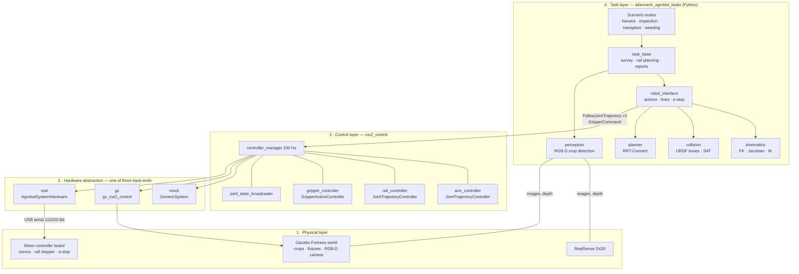
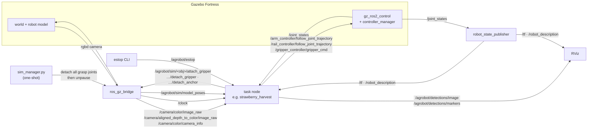
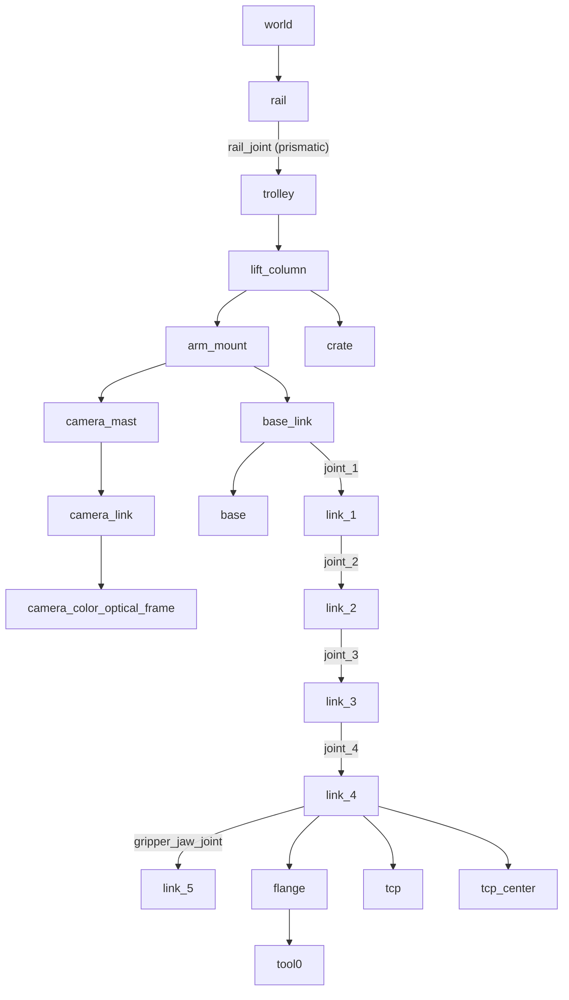
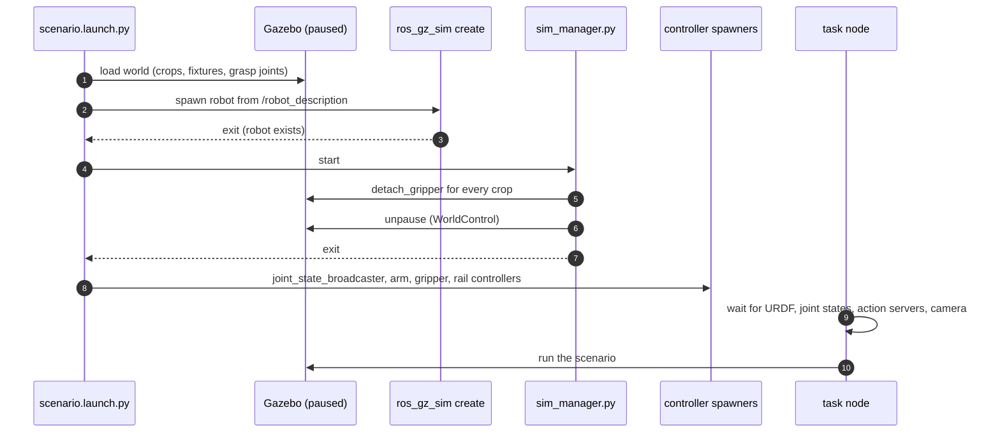
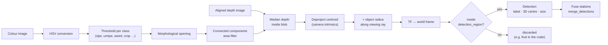
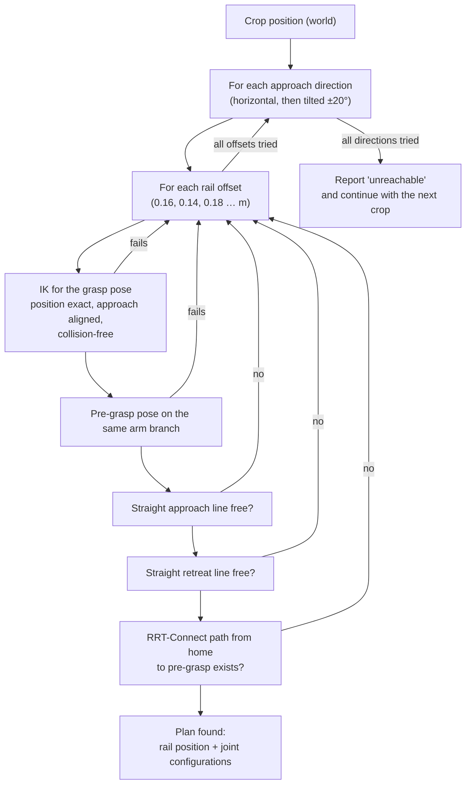
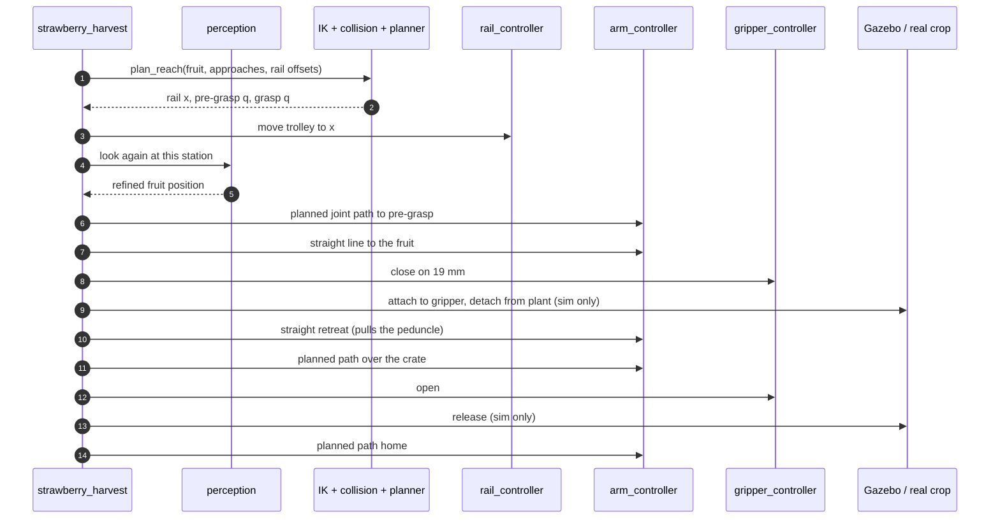
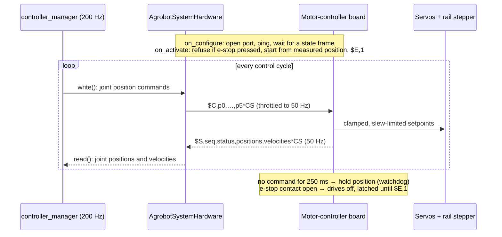
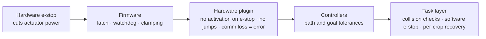

# How the system is built

This section explains how the parts fit together, from the physical robot up to the task logic. Read it before changing anything; every scenario and the real robot reuse the same layers.

## Layered architecture

The system has four layers. Each layer only talks to the layer directly below it through standard ROS 2 interfaces. That is why a task that works in Gazebo runs unchanged on the real robot.

| Layer | What it is responsible for | What you change here |
|---|---|---|
| 4. Tasks | What to do: find crops, choose where to put the rail, plan collision-free motions, grasp, report | New agricultural tasks, detection thresholds, crop layouts |
| 3. Control | Following joint trajectories smoothly and within tolerances, opening and closing the gripper | Gains, tolerances, update rate (`controllers.yaml`) |
| 2. Hardware abstraction | Turning joint commands into actuator commands and reading joint states | New actuators or drives (a new `SystemInterface` plugin) |
| 1. Physical | The robot, the crops and the camera, real or simulated | Mechanics, wiring, world models |

## ROS 2 graph: nodes, topics and actions

The graph below is what runs during `scenario.launch.py`. In simulation, the camera topics come from `ros_gz_bridge`. On the real robot, the same topic names come from `realsense2_camera`.

| Interface | Type | Direction | Purpose |
|---|---|---|---|
| `/arm_controller/follow_joint_trajectory` | `control_msgs/FollowJointTrajectory` (action) | task → controller | Arm motion (joints 1–4) |
| `/rail_controller/follow_joint_trajectory` | `control_msgs/FollowJointTrajectory` (action) | task → controller | Trolley position along the row |
| `/gripper_controller/gripper_cmd` | `control_msgs/GripperCommand` (action) | task → controller | Open or close the jaw |
| `/joint_states` | `sensor_msgs/JointState` | controller → all | Measured joint positions and velocities |
| `/camera/color/image_raw`, `/camera/aligned_depth_to_color/image_raw`, `/camera/color/camera_info` | `sensor_msgs/Image`, `CameraInfo` | camera → task | RGB-D input for crop detection |
| `/agrobot/detections/image`, `/agrobot/detections/markers` | `Image`, `MarkerArray` | task → RViz | What the robot detected, for debugging |
| `/agrobot/estop` | `std_msgs/Bool` (latched) | operator → task | Software emergency stop |
| `/agrobot/sim/model_poses` | `tf2_msgs/TFMessage` | Gazebo → task | Ground truth, only used to score a simulated run |
| `/agrobot/sim/<obj>/attach_gripper`, `…/detach_gripper`, `…/detach_anchor` | `std_msgs/Empty` | task → Gazebo | Simulated grasping (no-ops on the real robot) |

## Frames (TF tree)

All positions in the task layer are expressed in `world` (crop map) or `arm_mount` (motion planning). The rail joint moves everything below `trolley`, so a crop's position in `arm_mount` changes when the trolley moves.

## Simulation start-up

Grasping in Gazebo relies on `DetachableJoint`s, which Gazebo creates *attached*. The launch sequence therefore loads the world paused, releases all grasp joints, and only then starts physics and the controllers.

## Inside the task layer

| Module | Responsibility | Key ideas |
|---|---|---|
| `perception.py` | Find crops in the RGB-D image and turn them into 3D points | HSV thresholds per class, blob size window, median depth, shift by object radius, transform with TF into `world`, crop region filter |
| `kinematics.py` | Forward and inverse kinematics from the URDF | Geometric Jacobian; IK solves position first, then uses the one redundant DOF to align the approach direction (null-space); multi-start; `track`/`refine` for local solutions |
| `collision.py` | Is a joint configuration collision-free? | The URDF's own collision boxes, separating-axis test, arm vs. carrier, arm vs. itself, arm and held crop vs. obstacle boxes (gutter, bench, tray, crops). Scene obstacles need 3 mm clearance, because touching them stalls the arm |
| `planner.py` | Collision-free joint path between two configurations | RRT-Connect with random shortcutting; direct path if already free |
| `robot_interface.py` | Execute motions safely | Planned joint moves (quintic segments), straight TCP lines (interpolated between known start and end configurations, so the wrist never flips; step-by-step tracking as fallback), rail and gripper actions, e-stop cancelling, simulated grasp topics, retrying goals while controllers start |
| `task_base.py` | Shared scenario logic | Rail as external axis (`plan_reach`), compliant approach (a stop on contact within 12 mm of the goal still grips, because crops are soft and never exactly where the camera saw them), crop obstacles, recovery, sim ground truth, reports |

### Perception pipeline

### Motion planning pipeline

For every crop the task layer answers: *where must the trolley stand, and how does the arm get there without hitting anything?*

## One harvest cycle, end to end

## Real-robot data path

On the real robot the same controllers talk to `AgrobotSystemHardware`, which exchanges short ASCII frames with the motor-controller board.

## Safety layers

1. **Motor-controller board.** A hardware e-stop input (normally-closed contact) cuts servo PWM and disables the stepper. It stays latched until the host re-enables it. A 250 ms command watchdog holds position if commands stop, and setpoints are clamped and slew-limited in firmware.
2. **Hardware plugin.** It refuses to activate while the e-stop is pressed, starts from the measured position (no jump), and reports a communication error after 10 missed frames.
3. **Controllers.** Path and goal tolerances abort a trajectory if the arm is blocked.
4. **Task layer.**
   - A software e-stop on `/agrobot/estop` (`ros2 run aibomech_agrobot_tasks estop on|off`) cancels motion.
   - Every joint move is collision-checked and planned, and linear moves are checked point by point.
   - A failed crop is reported and the robot recovers to home.
