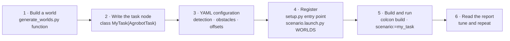

# Development guide

How to build and test the workspace, extend the robot with your own agricultural task, tune its configuration and solve common problems.

- [Building and testing](#building-and-testing)
- [Adding your own task](#adding-your-own-task)
- [Configuration reference](#configuration-reference)
- [Troubleshooting](#troubleshooting)
- [Development notes](#development-notes)

## Building and testing

```bash
cd agrobot_ws
source /opt/ros/humble/setup.bash
colcon build --symlink-install
source install/setup.bash
colcon test && colcon test-result --verbose
```

The tests cover:

| Package | Tests |
|---|---|
| `aibomech_agrobot_description` | the xacro expands to a valid URDF for every platform and hardware back-end; limits, inertias and standard frames are present |
| `aibomech_agrobot_hardware` | the serial protocol: frame encoding, checksums, rejected corrupt frames |
| `aibomech_agrobot_tasks` | IK accuracy, collision checking, the RRT planner, and that every task configuration is a valid ROS 2 parameter file |

`--symlink-install` links Python files and configurations into `install/`, so edits take effect without rebuilding. New files still need a `colcon build`.

The GitHub Actions workflow in `.github/workflows/ci.yml` builds and tests the workspace on every push.

## Adding your own task

A new agricultural task (for example tomato de-leafing, sprout thinning or fruit counting on a different crop) is a new node on top of `AgrobotTask`. You get the robot interface, the camera, planning, collision checking and reporting for free.



1. **World.** Add a function to `aibomech_agrobot_gazebo/tools/generate_worlds.py` that places your crops. Use `grasp_plugin()` for objects the robot picks and `anchor_plugin()` for objects fixed to a plant or the soil. Keep crop fixtures `<static>` and inside the arm's reach (about 0.25–0.32 m from J1 for top-down grasps, 6–7 cm below the mount plate). Run the script; it writes the world, the object list and the bridge file.
2. **Task node.** Create `aibomech_agrobot_tasks/scenarios/my_task.py`:

   ```python
   import numpy as np
   from ..perception import classes_from_params
   from ..task_base import AgrobotTask, run_task

   DOWN = np.array([0.0, 0.0, -1.0])

   class MyTask(AgrobotTask):
       name = 'my_task'

       def __init__(self):
           super().__init__()
           self.classes = classes_from_params(self.node, 'detection', ['target'])

       def execute(self):
           self.go_home()
           self.robot.move_rail(0.5)
           detections, image = self.camera.detect(self.classes)
           for det in detections:
               plan = self.plan_reach(det.position, DOWN, 0.05, [0.0, 0.05, -0.05], np.radians(35))
               if plan is None:
                   continue
               self.robot.move_rail(plan.rail)
               self.robot.move_joints(plan.q_pre)
               p = self.robot.world_to_base(det.position)
               self.robot.move_linear(p, DOWN, None, plan.q_grasp)
               # ... grip, lift, place ...
               self.go_home()
           self.write_report({'view.png': image})

   def main():
       raise SystemExit(run_task(MyTask))
   ```

3. **Configuration.** Create `config/my_task.yaml` with the `detection.<class>.hsv_ranges`, `detection_region` and `obstacles` of your scene (see [Configuration reference](#configuration-reference)).
4. **Register.** Add `'my_task = aibomech_agrobot_tasks.scenarios.my_task:main'` to `setup.py` and `'my_task': '<world name>'` to `WORLDS` in `launch/scenario.launch.py`.
5. **Run.** `colcon build --symlink-install`, then `ros2 launch aibomech_agrobot_tasks scenario.launch.py scenario:=my_task`.

---

## Configuration reference

Parameters shared by all task nodes (set them in the task's YAML file or with `-p name:=value`):

| Parameter | Default | Meaning |
|---|---|---|
| `speed_scale` | 0.5 (0.7 in the task files) | Fraction of the joint velocity limits used for joint moves |
| `cartesian_speed` | 0.04 m/s | TCP speed on straight approach and retreat lines |
| `home_joints` | `[-0.97, -2.0, -1.12, 1.46]` | Folded pose outside the camera view; start, recovery and return pose |
| `rail_limits` | `[0.03, 2.97]` m | Rail range the tasks may use (kept off the end stops) |
| `obstacles` | none | Fixed scene boxes, flat list `[cx, cy, cz, sx, sy, sz, …]` in the world frame; the arm keeps 3 mm clearance to them |
| `crop_clearance` | -0.002 m | Clearance to crop boxes (neighbouring fruit, lettuce, seedlings); negative lets the gripper brush soft crops, the transplant task uses +0.003 for rigid soil blocks |
| `detection_region` | unlimited | Box `[x_min, x_max, y_min, y_max, z_min, z_max]` (world) outside which detections are ignored |
| `detection.<class>.hsv_ranges` | – | One or more ranges `h_lo s_lo v_lo h_hi s_hi v_hi` (OpenCV units, H 0–179) |
| `detection.<class>.min_area` / `max_area` | 30 / 20000 px | Blob size window |
| `detection.<class>.radius` | 0.01 m | Surface-to-centre correction along the viewing ray |
| `gripper_open`, `gripper_effort`, `jaw_gap_offset` | 0.010 m, 8 N, 0.0174 m | Gripper opening, force, and the jaw offset used to close on an object of known width |
| `tcp_frame` | `tcp` | Tool frame the task positions: `tcp` for fruit, `tcp_center` for thin stems (weeding) |
| `held_half_size`, `held_offset` | 12 mm cube at the TCP | Size (half extents, tcp frame) and centre offset of a gripped crop for collision checking; the soil block and the pulled weed use longer boxes hanging below the TCP |
| `sim_grasp` | `true` in simulation | Drive the Gazebo grasp joints; set automatically by `scenario.launch.py` |
| `report_dir` | `~/.ros/agrobot_reports` | Where reports are written |

Task-specific parameters (all in `agrobot_ws/src/aibomech_agrobot_tasks/config/`):

| Task | Main parameters |
|---|---|
| `strawberry_harvest` | `survey_stations`, `approaches` (tried in order), `rail_offsets`, `pregrasp_distance`, `retreat_offset`, `max_approach_error_deg`, `fruit_width`, `fruit_obstacle_size`, `drop_height`, `refine_radius`, `max_fruit` |
| `plant_inspection` | `plant_positions`, `plant_window`, `mean_fruit_mass_kg`, `detection.leaf` |
| `seedling_transplant` | `tray.first_cell`, `tray.pitch`, `tray.cols/rows`, `tray.grasp_z`, `pots.*`, `check_occupancy`, `plug_width`, `lift_height`, `max_plants` |
| `precision_weeding` | `survey_stations`, `crop_protection_radius`, `crop_obstacle_size`, `grasp_height_above_detection`, `stem_width`, `pull_height`, `max_weeds` |

Robot-level configuration (in `agrobot_ws/src/aibomech_agrobot_description/config/` and `aibomech_agrobot_bringup/config/`):

| File | Contents |
|---|---|
| `joint_limits.yaml` | Position, velocity and effort limits, damping, friction, soft-limit margins |
| `arm_physical.yaml` | Generated masses, inertias and collision boxes (do not edit by hand) |
| `initial_positions.yaml` | Start pose for simulation and mock hardware |
| `hardware_calibration.yaml` | Real robot: board channel, direction and offset per joint |
| `controllers.yaml` | Controller types, joints, update rate and trajectory tolerances |

## Troubleshooting

| Symptom | Cause and fix |
|---|---|
| `cv_bridge` crashes with `_ARRAY_API not found` | NumPy 2 from pip shadows the system NumPy. The tasks avoid `cv_bridge`, but other tools need `pip install "numpy<2"` |
| Rail does not move in Gazebo | A prismatic joint that *starts* exactly on its limit is locked by the physics engine. `initial_positions.yaml` starts the rail at 0.05 m |
| Robot joints frozen in a new world | A joint to `world` in more than one model freezes the robot's rail in Gazebo Fortress. Crop fixtures are `<static>` models |
| Two simulations interfere | gz-transport ignores `ROS_DOMAIN_ID`. Set a different `IGN_PARTITION` per simulation |
| A fruit is reported `unreachable` | No rail position and approach direction gives a collision-free grasp; usually a neighbour or the gutter is in the way. It is retried after the first pass. Try more `rail_offsets` or `approaches`, or a smaller `fruit_obstacle_size` |
| Your own simulation stops when another one starts | Two launches on one machine share ROS topics and Gazebo transport. Use a different `ROS_DOMAIN_ID` and `IGN_PARTITION` per session |
| `path tolerance violation` during a task | The arm touched something the collision model does not know about. Add the object to `obstacles`, or raise `crop_protection_radius` or `fruit_obstacle_size` |
| Everything is black in Gazebo | A GPU or EGL problem. Try `export LIBGL_ALWAYS_SOFTWARE=1`, or run with `gui:=false` |

---

## Development notes

- **Collision model.** The task layer's collision model reads the same boxes as Gazebo, so a motion that passes the checker does not jam in simulation.
- **Grasp tuning.** Tune `jaw_gap_offset` and the TCP (`tcp_*` in `arm.xacro`) together if you change the gripper.
- **Worlds.** Regenerate them after changing `MOUNT_HEIGHT` or the robot geometry: `python3 agrobot_ws/src/aibomech_agrobot_gazebo/tools/generate_worlds.py`.
- **Physical parameters.** Regenerate them after changing the CAD or the actuators: `python3 agrobot_ws/src/aibomech_agrobot_description/tools/compute_physical_params.py`.
- **Possible extensions:**
  - a MoveIt 2 configuration for interactive planning;
  - a trained crop detector;
  - a soft or vacuum end effector for larger fruit;
  - a mobile base instead of the rail.
