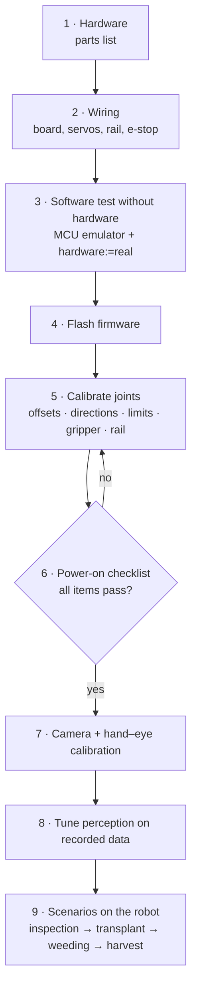

# Moving to the real robot: step by step

The task nodes, controllers and topic names are identical in simulation and on the robot. Only the hardware back-end and the camera driver change. Work through the steps in order; each one is tested before the next adds risk.



| | Simulation | Real robot |
|---|---|---|
| Launch | `scenario.launch.py` (default `hardware:=sim`) | `scenario.launch.py hardware:=real serial_port:=… platform:=…` |
| ros2_control plugin | `gz_ros2_control/GazeboSimSystem` | `aibomech_agrobot_hardware/AgrobotSystemHardware` |
| Camera topics | from `ros_gz_bridge` | from `realsense2_camera` (same names) |
| Grasping | `DetachableJoint` topics (`sim_grasp:=true`) | the jaw holds the crop, the retreat breaks the stem (`sim_grasp:=false`) |
| Clock | `/clock` from Gazebo (`use_sim_time`) | system time |
| Scoring | ground truth from Gazebo poses | from `results.csv` and the operator |

## Step 1: Hardware (bill of materials)

| Item | Recommendation | Notes |
|---|---|---|
| J1–J3 actuators | 12 V smart serial servos, ≥ 2.9 N·m (Feetech STS3215, Dynamixel XL430-W250) | Must match the effort limits in `joint_limits.yaml`. Smart servos report their real position |
| J4 and gripper | STS3032 / XL330 class servo; gripper servo on a rack driving the moving jaw | Gripper stroke 27 mm |
| Motor-controller board | Arduino Mega 2560, ESP32 or Teensy 4.1 | Runs `firmware/agrobot_mcu` |
| Rail axis | NEMA17 or NEMA23 stepper, TMC2209 driver, GT2 belt or rack; home switch at the rail start | Only for `platform:=rail_trolley` |
| Camera | Intel RealSense D435 / D435i | Mounted as in `camera.xacro` (`camera_xyz`, `camera_rpy` arguments) |
| Safety | Mushroom e-stop (NC contact) wired in series with the actuator supply and to the e-stop pin; 24 V/12 V supply with fuses | The e-stop must cut power in hardware. The software e-stop is only a supplement |
| Computer | Ubuntu 22.04 with ROS 2 Humble (NUC, Jetson Orin or laptop) | USB 3 for the camera |

## Step 2: Wire the controller board

| Signal | Pin (Arduino Mega) |
|---|---|
| Servo PWM J1, J2, J3, J4, gripper | 3, 5, 6, 9, 10 |
| Rail STEP / DIR / ENABLE | 22 / 23 / 24 |
| Rail home switch (to GND) | 25 |
| E-stop contact (NC, to GND) | 2 |

Power the servos from a separate supply with a common ground; never power them from the board. If you use smart bus servos, replace the PWM output and the position estimate in the firmware with the servo library's read and write calls. The protocol to ROS stays the same.

## Step 3: Test the whole software chain without hardware

```bash
ros2 run aibomech_agrobot_hardware mcu_emulator.py --link /tmp/agrobot_mcu
ros2 launch aibomech_agrobot_bringup robot.launch.py hardware:=real serial_port:=/tmp/agrobot_mcu
ros2 control list_controllers          # all four active
pkill -USR1 -f mcu_emulator.py         # press the emulated e-stop, watch the log
```

This exercises the real plugin, the serial protocol, the watchdog and the e-stop path.

## Step 4: Flash the firmware

1. Open `agrobot_ws/src/aibomech_agrobot_hardware/firmware/agrobot_mcu/agrobot_mcu.ino`.
2. Check the pin assignment and the `SERVO_CENTER_US`, `SERVO_US_PER_UNIT` and `RAIL_STEPS_PER_M` values for your hardware.
3. Flash the board, for example `arduino-cli compile -b arduino:avr:mega … && arduino-cli upload …`.
4. Give the serial device a fixed name with a udev rule, for example `/dev/agrobot_mcu`, and add yourself to the `dialout` group.

## Step 5: Calibrate the joints

1. **Mechanical zero.** Move every joint by hand, or at low torque, to the pose the URDF calls zero. `ros2 launch aibomech_agrobot_description view_robot.launch.py` with all sliders at 0 shows that pose.
2. **Read the offsets.** With the robot launched on real hardware, run `ros2 topic echo /joint_states` and read the reported positions. Enter them with opposite sign as `offset` in `agrobot_ws/src/aibomech_agrobot_description/config/hardware_calibration.yaml`, or pass your own file with `calibration_file:=`.
3. **Directions.** Command small moves, for example +0.1 rad with the `ros2 action send_goal` line from the Quick start. Compare them with RViz and set `direction: -1` where the real joint turns the other way.
4. **Limits.** Jog each joint towards both ends at `speed_scale` 0.2. Keep the software limits at least 3° inside the mechanical stops.
5. **Gripper.** Close the jaw on a 20 mm gauge. The jaw position should read about 0.0026. Tune `jaw_gap_offset` in the task configuration if it differs.
6. **Rail.** Home the rail, drive to 1.000 m and measure. Correct `RAIL_STEPS_PER_M`.

## Step 6: First power-on checklist

- [ ] E-stop cuts actuator power, and the log shows "EMERGENCY STOP pressed".
- [ ] `robot.launch.py hardware:=real` refuses to activate while the e-stop is pressed.
- [ ] RViz model matches the real arm in at least three poses.
- [ ] Home pose (`HOME` in `task_base.py`) is collision-free on the real robot.
- [ ] Unplugging USB stops the arm within 0.25 s (watchdog).
- [ ] The first scenario run uses `speed_scale:=0.2` with the cell cleared of people.

## Step 7: Camera and hand–eye calibration

1. Start the camera: `robot.launch.py … realsense:=true`. It is started with `align_depth.enable:=true`, `publish_tf:=false` and the topic names the tasks expect (`/camera/color/image_raw`, `/camera/aligned_depth_to_color/image_raw`, `/camera/color/camera_info`).
2. Measure the camera pose on the mast and pass it as `camera_xyz:="x y z" camera_rpy:="r p y"` to `robot.launch.py`. For accurate picking, run an eye-to-hand calibration (for example `easy_handeye2` with an ArUco marker in the gripper) and write the result into those two arguments.
3. **Check.** Put a red ball at a measured position, run `plant_inspection`, and compare the logged 3D position. Aim for an error under 5 mm.

## Step 8: Tune perception for real crops

The HSV ranges in the task YAML files were tuned on the rendered colours. Tune them for real crops:

1. Record a bag at the site: `ros2 bag record /camera/color/image_raw /camera/aligned_depth_to_color/image_raw /camera/color/camera_info`.
2. Adjust the ranges until the `/agrobot/detections/image` overlay is clean. Use `detection_region` to exclude the crate and the background.

For production, replace `segment()` in `perception.py` with a trained segmentation network. The PyTorch notebook in `Manuplator-Analysis-and-control` is a starting point. The rest of the pipeline, from depth to world coordinates and planning, stays unchanged.

## Step 9: Run the scenarios on the real robot

```bash
ros2 launch aibomech_agrobot_tasks scenario.launch.py scenario:=plant_inspection hardware:=real serial_port:=/dev/agrobot_mcu
ros2 launch aibomech_agrobot_tasks scenario.launch.py scenario:=strawberry_harvest hardware:=real platform:=rail_trolley
```

Suggested order: `plant_inspection` (no contact) → `seedling_transplant` (fixtures, easy objects) → `precision_weeding` → `strawberry_harvest`.

Adapt the following to your site:

- **Obstacle boxes (`obstacles`).** Enter the real gutter, bench or bed dimensions.
- **Fixture positions.** Teach the tray and pot positions: jog the TCP to the first cell, read the `tcp` frame from TF, and enter it in the YAML.
- **`mount_height`.** Pass the real height of the lift column (the `mount_height` argument).

`sim_grasp` is switched off automatically with `hardware:=real`.

## Recovering from an e-stop

1. Release the e-stop.
2. Re-activate the hardware:

   ```bash
   ros2 control set_hardware_component_state AgrobotSystem inactive
   ros2 control set_hardware_component_state AgrobotSystem active
   ros2 run aibomech_agrobot_tasks estop off
   ```

The task that was running exits with code 2; restart it. It re-surveys the crop, so no state is lost.
