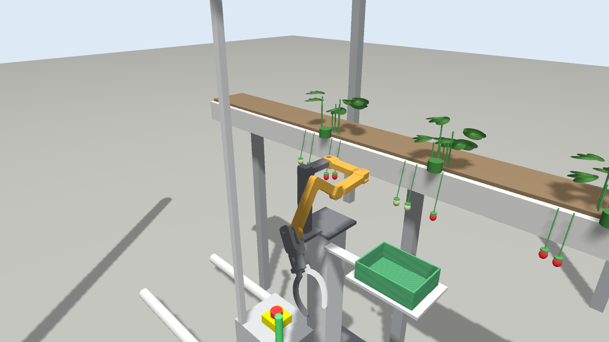
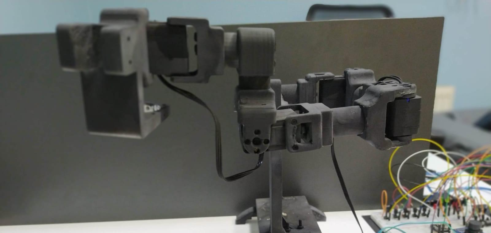
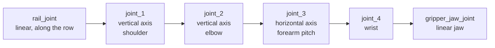
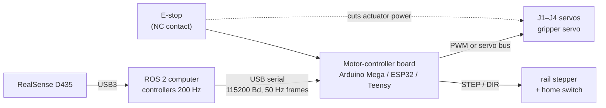

# Robot design

This document describes the robot as a machine: its structure, dimensions, frames, actuators, gripper, sensor and carrier, and the reasons behind each choice. The calculations are in [`analysis/`](../analysis/).

## From prototype to v2

The first prototype (above) was 3D-printed and analysed in the [paper](../analysis/kinematics.md). The robot in this repository (v2) keeps its SCARA-plus-pitch structure and changes what the tests showed:

| | Prototype (paper) | v2 (this repository) |
|---|---|---|
| Wrist J4 | parallel to J3 (pitch) | perpendicular to J3 (turns the gripper) |
| End effectors | fertiliser nozzle with peristaltic pump + gripper | one gripper; the nozzle is a possible extension |
| Servos | LX-16A (1.47 N·m) on every joint; vibration at J1 and J3 | 2.9 N·m on J1–J3, 1.5 N·m on J4 ([why](../analysis/dynamics.md#9-from-torques-to-motors)) |
| Mounting | lab table | greenhouse rail trolley (also `pedestal` and `table`) |

## Overview

| Part | Design | Why |
|---|---|---|
| Arm | 4 revolute joints: two vertical (SCARA plane), a pitch joint and a wrist; 3D-printed links from the prototype CAD | light and cheap; the SCARA plane gives a large horizontal reach with little gravity load |
| Actuators | 12 V smart serial servos, 2.9 N·m (J1–J3), 1.5 N·m (J4) | position feedback, daisy-chained bus, 6× or more torque margin (see [torque sizing](../analysis/README.md#4-actuator-sizing)) |
| Gripper | single-acting jaw: one fixed curved jaw, one sliding jaw on a rack, 27 mm opening | simple and robust; enough for strawberries, cherry tomatoes, soil blocks and weed stems |
| Carrier | trolley on the greenhouse heating pipes, with an adjustable lift column | the standard transport system in greenhouses; adds a linear axis along the row |
| Sensor | RGB-D camera (RealSense D435 class) on a mast behind the arm | colour for classification, depth for 3D positions, sees the whole work zone from one place |
| Control | `ros2_control` with trajectory controllers; motor-controller board over USB serial | the same controllers in simulation and on hardware |

## Kinematic structure

| Joint | Type | Function | Range | Velocity limit | Effort limit |
|---|---|---|---|---|---|
| `rail_joint` | prismatic | trolley along the crop row (external axis) | 0 … 3 m | 0.3 m/s | 200 N |
| `joint_1` | revolute | shoulder, vertical axis | −1.09 … 2.10 rad | 2.0 rad/s | 2.9 N·m |
| `joint_2` | revolute | elbow, vertical axis (SCARA plane) | −2.10 … 1.11 rad | 2.0 rad/s | 2.9 N·m |
| `joint_3` | revolute | forearm pitch, horizontal axis | −2.00 … 1.10 rad | 2.0 rad/s | 2.9 N·m |
| `joint_4` | revolute | wrist rotation | −1.00 … 2.30 rad | 3.0 rad/s | 1.5 N·m |
| `gripper_jaw_joint` | prismatic | moving jaw (0.010 = open) | −0.017 … 0.010 m | 0.05 m/s | 20 N |

Link lengths: 120 mm for each of the two horizontal links, about 120 mm for the forearm (J3 to J4), and 135 mm from the wrist to the TCP. Reach from the J1 axis is up to 0.51 m.

The joint origins and meshes come unchanged from the SolidWorks model of the real prototype (`aibomech_agrobot_description/cad/`). All limits are in `config/joint_limits.yaml`, one place for the URDF, the controllers and the tasks.

### Why the arm needs the rail

To place the TCP at a point, three of the four joints are used up, leaving one degree of freedom to orient the gripper. The arm can therefore not approach every point from every direction. The [workspace analysis](../analysis/README.md#2-workspace) shows:

- **Top-down grasps** are accurate on a band 0.25–0.32 m from J1, 6–7 cm below the mounting plate.
- **Horizontal grasps into the crop row** work best when the crop is to the side of J1 along the row.

The rail turns this limitation into a design feature. Before every grasp, the software moves the trolley so that the crop lands in the arm's best region, like the external axis of an industrial robot cell. The bench, tray and gutter heights of the scenarios were chosen from the same analysis.

## Frames

The frames follow ROS-Industrial conventions, so tools and calibration work like on an industrial robot:

| Frame | Where | Used for |
|---|---|---|
| `world` | floor, start of the rail | crop positions, obstacles |
| `arm_mount` | top of the lift column, x along the row, z up | motion planning (moves with the trolley) |
| `base` | J1 axis on the mounting plate | ROS-Industrial base frame |
| `flange`, `tool0` | wrist mounting face, z out of the tool | attaching other end effectors |
| `tcp` | between the jaws, where a 19 mm fruit touching the fixed jaw has its centre; z = approach direction | fruit, soil blocks |
| `tcp_center` | middle of the open jaw gap | thin stems (weeding) |
| `crate` | drop-off point in the crate | placing harvested crops |
| `camera_color_optical_frame` | camera optical centre, z forward | perception (same name as the RealSense driver) |

## Physical parameters

The masses are not guessed. `tools/compute_physical_params.py` builds them from two sources:

1. **CAD mass properties** of every printed part (`cad/aibomech_agrobot_v2_mass_properties.csv`), increased by 10 % for fasteners and cables.
2. **One servo per joint** (60 g, 20 g for the gripper), placed at the joint it drives.

The two are combined with the parallel-axis theorem, $I = \sum_k I_{c,k} + m_k(\lVert d_k\rVert^2 I - d_k d_k^\top)$, and every result is checked to be a physical inertia (positive, triangle inequality). The moving arm weighs 0.49 kg, the base 0.31 kg.

Collision geometry uses boxes derived from the mesh bounds, not the meshes themselves. This is the practice of industrial robot packages: fast and robust collision checking, with detailed meshes only for display. The L-shaped base (foot, post, bracket) and the gripper (body, fixed jaw) are split into several boxes, so the gripper keeps its real opening.

## Gripper

The gripper has one fixed, curved jaw and one jaw that slides on a rack driven by a small servo.

| Quantity | Value |
|---|---|
| Opening | gap = jaw position + 17.4 mm, so 27.4 mm fully open |
| Largest object | about 23 mm with 2 mm clearance per side |
| Closing on an object of width w | jaw position = w − 17.4 mm − 1 mm (1 mm squeeze) |
| Jaw speed and force | 0.05 m/s, 20 N |

Because only one jaw moves, an object is pushed against the fixed jaw. This is why there are two tool frames. `tcp` is for round objects such as a fruit, whose centre ends up 10 mm from the fixed jaw. `tcp_center` is for thin stems, which the fixed jaw must not touch on the way in.

## Carrier and cell

Three carriers are selected with the xacro argument `platform:=`:

- **`rail_trolley`** (default): a trolley running on two 51 mm heating pipes 0.4 m apart. It carries an aluminium lift column (`mount_height`, default 0.85 m), an electrical cabinet with e-stop and signal tower, the camera mast, and the harvest crate on a bracket beside the arm. The crate sits at the arm's height and outside the camera's view of the crop row, so full crates never block the arm or confuse the detector.
- **`pedestal`**: the same column on a floor plate, for bench work without a rail.
- **`table`**: the bare arm on a table, as in the lab prototype.

The camera sits on a mast at the back corner of the trolley, 0.6 m above the mounting plate, looking down at the work zone. It sees 0.91 m of the row at 1.4 mm per pixel, which is about 13 pixels across a strawberry. The mast was moved out of the arm's reach after collision tests.

## Control and electronics

- **Three hardware back-ends, one set of controllers.** `ros2_control` runs the same arm, rail and gripper controllers on mock hardware, in Gazebo and on the real board. Only the hardware plugin changes (`hardware:=mock|gz|real`).
- **Serial protocol.** The protocol between the computer and the board is plain text with checksums, so it can be read in a serial monitor while debugging. Its details are in [architecture.md](architecture.md#real-robot-data-path).
- **Calibration.** Joint offsets and directions are data (`config/hardware_calibration.yaml`), not code.

## Where to find things

| Topic | File |
|---|---|
| Robot description (xacro) | `agrobot_ws/src/aibomech_agrobot_description/urdf/` |
| Joint limits, initial pose, calibration | `agrobot_ws/src/aibomech_agrobot_description/config/` |
| Mass and collision parameters (generated) | `config/arm_physical.yaml`, from `tools/compute_physical_params.py` |
| Controllers | `agrobot_ws/src/aibomech_agrobot_bringup/config/controllers.yaml` |
| Firmware | `agrobot_ws/src/aibomech_agrobot_hardware/firmware/agrobot_mcu/` |
| Calculations | [`analysis/`](../analysis/) |
