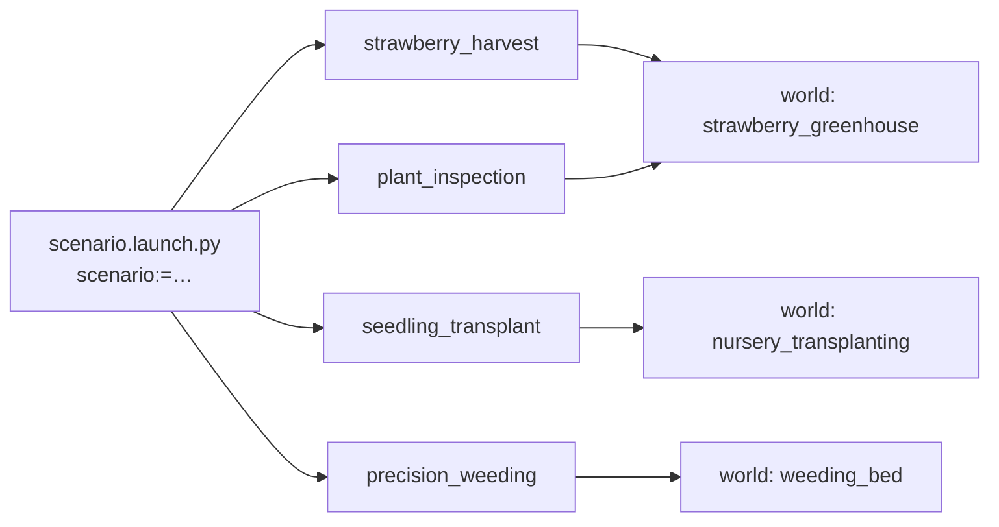
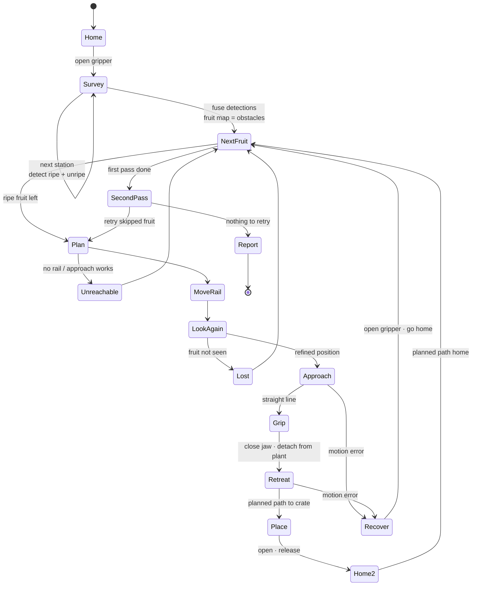
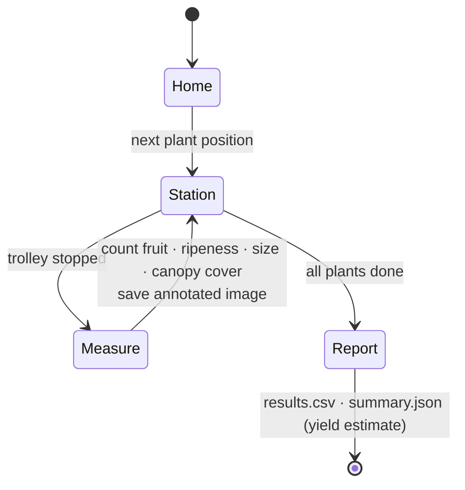
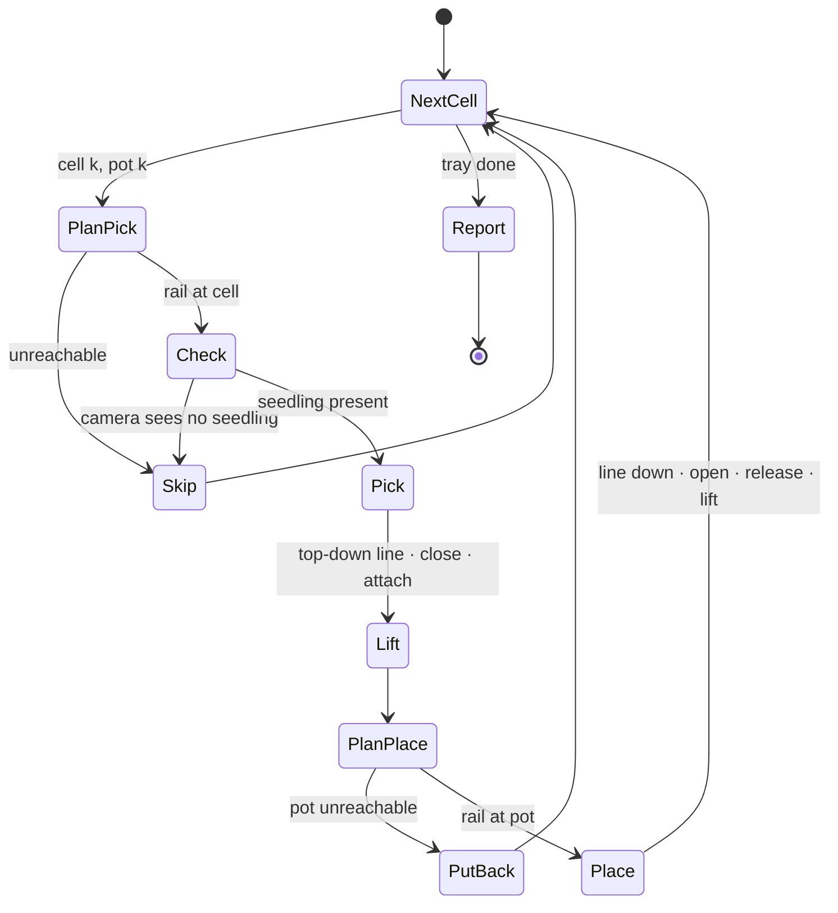
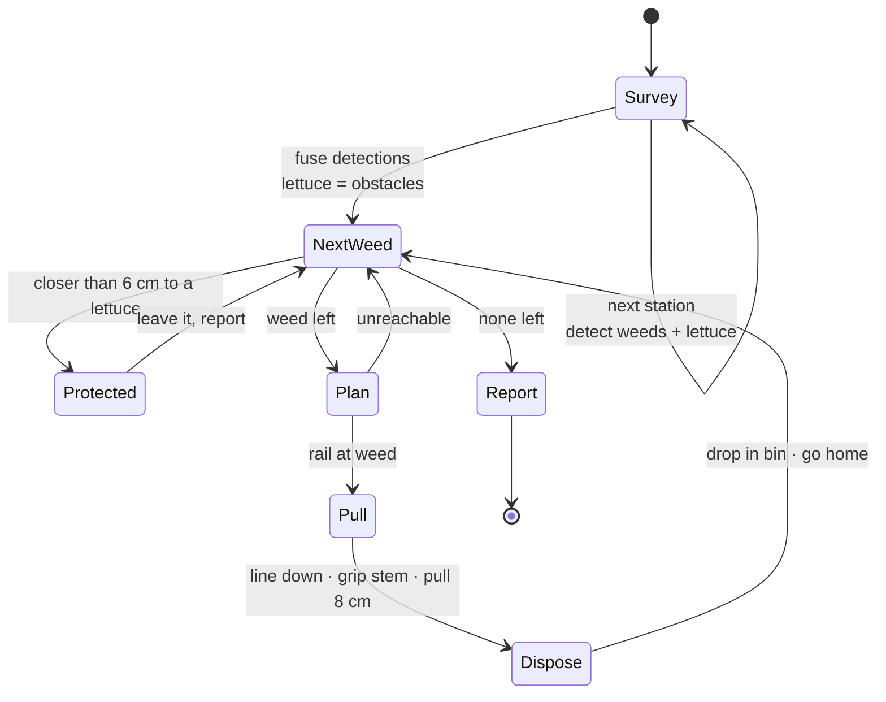

# Agricultural scenarios

The four scenarios cover the jobs that take most of the manual labour in protected cultivation (greenhouses, tunnels, nurseries): harvesting, crop monitoring, propagation and weeding. Each one is a complete robot application, from the camera image to the crop in the crate, and each is built so that the same code can run on the real robot.

| Scenario | Real-world problem | What the robot does | Value for a grower |
|---|---|---|---|
| [Strawberry harvesting](#1-selective-strawberry-harvesting-strawberry_harvest) | Harvesting is the largest labour cost of soft fruit, and pickers are hard to find at peak season | finds ripe fruit, picks only those, places them in a crate | picking on demand, also at night; no unripe fruit picked |
| [Plant inspection](#2-plant-inspection-and-phenotyping-plant_inspection) | Yield forecasts and crop scouting are done by walking the rows and counting by hand | counts ripe and unripe fruit per plant, measures size and canopy | daily yield forecast and harvest planning, a record per plant |
| [Seedling transplanting](#3-seedling-transplanting-seedling_transplant) | Moving thousands of seedlings from trays to pots is repetitive, precise handwork | picks each soil block from the tray and plants it in its pot | constant quality, frees staff for skilled work |
| [Precision weeding](#4-precision-weeding-precision_weeding) | Weeds compete with the crop; herbicides are being restricted and hand weeding is slow | finds weeds between lettuce and pulls them out with the root | no herbicide, the crop is protected by a safety radius |

Each section below states the problem, how the scenario works, and what separates it from a field-ready system.

Every scenario is started with one command. `scenario.launch.py` picks the matching world, starts Gazebo, the controllers and RViz, and then the task node with its YAML configuration:

```bash
ros2 launch aibomech_agrobot_tasks scenario.launch.py scenario:=<name> [gui:=false] [rviz:=false] [hardware:=sim|real|mock]
```



The worlds are generated by `agrobot_ws/src/aibomech_agrobot_gazebo/tools/generate_worlds.py` with fixed random seeds, so every run sees the same crop. Change the seed or the layout there and re-run the script. It rewrites the world, the ground-truth list (`config/<world>_objects.yaml`) and the bridge configuration.

## 1. Selective strawberry harvesting (`strawberry_harvest`)

**Problem.** In table-top strawberry production, fruit ripens continuously and must be picked every few days at the right stage. Picking is the largest labour cost, and labour is scarce exactly at peak season. A robot must tell ripe from unripe fruit, reach fruit that hangs between leaves and neighbours, and handle it without bruising.

**Scene.** A table-top gutter 1.0 m high runs along the rail with six strawberry plants. Their trusses hang over the aisle edge with ripe (red) and unripe (pale green) fruit, 19 mm in diameter.


**Pipeline:**

1. **Survey.** The trolley stops at six stations. The camera segments ripe and unripe fruit in HSV. The 3D position comes from the median depth of each blob, pushed back by the fruit radius. Detections from all stations are fused in the world frame.
2. **Plan.** For every ripe fruit, the rail candidates are evaluated with IK, first for a horizontal approach and then for approaches tilted 20° up, down or sideways. The choice must pass three checks: the approach line and the retreat line are collision-free, and the planner finds a path from home. Non-target fruit and the gutter are obstacles (see [Motion planning pipeline](architecture.md#motion-planning-pipeline)).
3. **Look again.** At the chosen rail position the fruit is re-detected, so rail and calibration errors are corrected.
4. **Pick.**
   - Straight-line approach.
   - Close the jaw on the fruit width.
   - Pull back and down, which breaks the peduncle.
   - Planned move to the crate, release, then home.
5. **Second pass.** Fruit that could not be reached (usually because a ripe neighbour hangs 3–4 cm away and blocks the gripper) is retried once at the end, when its neighbours are in the crate.
6. **Report.** Detected, attempted and picked fruit, cycle times and, in simulation, fruit verified in the crate. Unripe fruit in the crate counts as an error.



The parameters are in `agrobot_ws/src/aibomech_agrobot_tasks/config/strawberry_harvest.yaml`: survey stations, HSV ranges, approach direction, rail offsets, obstacles and speeds.

**Towards the field.** Real fruit hides behind leaves and varies in colour. A learned detector (instance segmentation) replaces the HSV thresholds, and several camera views per fruit reduce occlusion. The gripper would need soft pads, or a cutting blade for the peduncle, to avoid bruising. The rail, IK, collision checking, second pass and reporting carry over unchanged.


## 2. Plant inspection and phenotyping (`plant_inspection`)

**Problem.** Growers plan labour and sales on yield forecasts, which today come from staff counting fruit by hand on sample plants. Plant health and growth are judged by eye. Automated scouting gives a daily, objective record of every plant.

This is non-contact: the arm stays folded and the trolley stops in front of each plant. For every plant the report records:

- ripe and unripe fruit count;
- ripeness ratio;
- equivalent fruit diameter;
- canopy cover (leaf-pixel share).

The summary adds the harvest-ready mass (`mean_fruit_mass_kg`). This is the daily scouting job a real greenhouse robot runs before harvesting.

**Towards the field.** The same pipeline works with a real RealSense camera. Accurate yield estimates need fruit tracking across stations (not only per-station counting), a calibrated size-to-mass model per variety, and possibly the arm moving the camera around leaves.




## 3. Seedling transplanting (`seedling_transplant`)

**Problem.** Nurseries move thousands of seedlings from propagation trays into pots. The work is repetitive, needs care not to damage the young plants, and competes for staff with more skilled jobs. Transplanting machines exist for large nurseries; a flexible arm suits smaller batches and mixed crops.

**Scene.** A potting bench 0.75 m high with a 2 × 4 propagation tray of 50 mm soil blocks (60 mm pitch, low walls) and a 2 × 4 grid of pots.

**Pipeline.** The tray and the pots are fixtures with taught positions (first cell plus pitch), as in nursery automation. For each cell:

1. Camera check that the cell holds a seedling.
2. Top-down pick of the block.
3. Lift, fold the arm, and move the rail to the pot. The rail only travels with the arm folded, so it never sweeps over the plants.
4. Top-down place, release, lift.

Seedlings still in the tray and seedlings already potted are obstacles for the planner, and the held soil block is checked as a 54 mm box hanging below the TCP. A seedling that fails is retried in a second pass.

The soil blocks stand higher than the tray walls, so the open jaws (about 60 mm across) never enter a cell. That is also why commercial transplanters prefer soil blocks.

**Towards the field.** Tray and pot positions are taught once per fixture, as in any automated cell. Plug trays with deep cells need a narrower gripper or needle grippers that grip the root ball. The camera check can be extended to grade seedlings and skip weak ones.



## 4. Precision weeding (`precision_weeding`)

**Problem.** Weeds compete with the crop for light, water and nutrients. Herbicide use is being restricted, organic production does not allow it, and hand weeding is slow and physically hard. Precision weeding removes only the weeds, and protects the crop.

**Scene.** A raised lettuce bed with purple broadleaf weeds in the inter-row.

**Pipeline:**

1. Survey detects weeds (purple) and lettuce (large green blobs).
2. Weeds closer than `crop_protection_radius` (6 cm) to a lettuce are left alone and reported. A real system would switch to a finer tool, a laser or a micro-sprayer there.
3. Every other weed is gripped at the stem, pulled 8 cm straight up with its root, and dropped into the bin on the trolley.
4. Lettuce heads are obstacles for the planner. A weed that fails is retried in a second pass.




**Towards the field.** Real weeds do not have a distinct colour. A crop/weed classifier trained on images of the actual crop is needed, and the weeding tool depends on the weed size: pulling for large weeds, a stamp, a laser or a micro-dose sprayer for small ones. The survey, protection radius, planning and reporting stay the same.

## Simulation results

Headless runs on a laptop (real-time factor below 1 because the camera is rendered):

| Scenario | Result | Mean cycle time |
|---|---|---|
| strawberry_harvest | 12/12 ripe fruit detected, 12 picked and verified in the crate (1 in the second pass), 0 unripe picked | 61 s |
| plant_inspection | 6 plants, 12/12 ripe and 10/10 unripe fruit counted | – |
| seedling_transplant | 8/8 seedlings placed and standing in their pots (verified from simulation poses) | 50 s |
| precision_weeding | 8/8 weeds detected and removed into the bin (3 in the second pass) | 57 s |

Cycle times include IK, collision-checked planning, the 0.6 s camera settle time and folding the arm before every rail move. They are dominated by Python planning and would drop to around 10–15 s with a compiled planner. A crop that fails is reported in `results.csv` and retried once in a second pass; a failure never stops the run.

## How grasping is simulated

Gazebo cannot hold a 19 mm strawberry reliably through friction, so contact grasping is emulated, as is common in agricultural simulation:

- **Grasp joints.** Each crop has a `DetachableJoint` towards the gripper link (`/agrobot/sim/<obj>/attach_gripper`, `…/detach_gripper`).
- **Plant or soil anchors.** Fruit and weeds are held by a second joint (`…/detach_anchor`), which the robot "cuts" or "pulls".
- **Start-up.** Gazebo creates these joints already attached, so `sim_manager.py` detaches them all while the world is still paused, and only then starts physics.
- **Collision cores.** Crops have small collision cores so the open jaws do not push them away.
- **Task layer.** The task nodes call `attach`, `release` and `detach_from_plant`. They are no-ops on the real robot (`sim_grasp:=false`), where the gripper physically holds the crop and the pull-back breaks the stem.

## Further applications

The same building blocks (rail, camera survey, IK with approach directions, collision checking, grasp and place, reports) cover other greenhouse jobs with little new code, see [Adding your own task](development.md#adding-your-own-task):

| Application | What changes |
|---|---|
| Cherry-tomato or pepper harvesting | detection classes, fruit size, approach from below the truss |
| Leaf removal (de-leafing) | detect old leaves, cutting tool instead of the gripper |
| Disease and pest scouting | classifier on the inspection images, no arm motion |
| Pollination support | detect open flowers, touch or vibrate them with a brush tool |
| Sample collection for lab analysis | pick single leaves or fruit into labelled positions of a tray |
